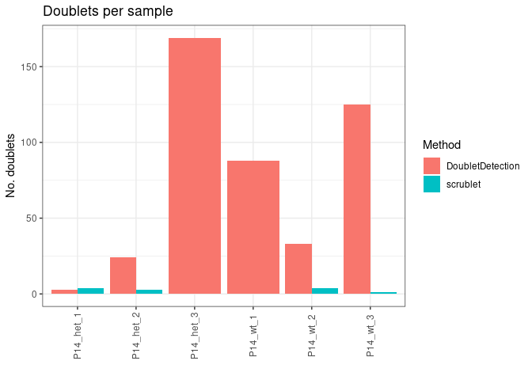
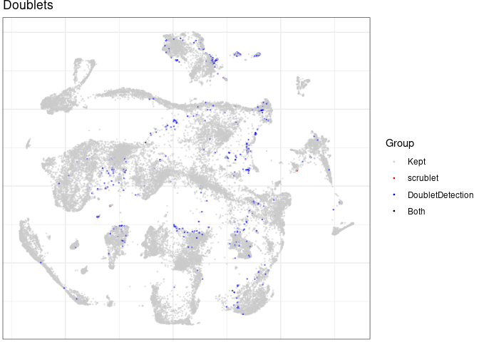

Quality Control using CRMetrics
================
Xian Xin
2023-03-02

-   <a href="#introduction" id="toc-introduction">Introduction</a>
-   <a href="#package-installation" id="toc-package-installation">Package
    installation</a>
    -   <a href="#required-r-packages" id="toc-required-r-packages">Required R
        packages</a>
    -   <a href="#python-environment-creation"
        id="toc-python-environment-creation">Python Environment creation</a>
    -   <a href="#required-python-modules"
        id="toc-required-python-modules">Required Python modules</a>
-   <a href="#crmetrics-object-initialisation"
    id="toc-crmetrics-object-initialisation">CRMetrics object
    initialisation</a>
-   <a href="#ambient-rna-removal" id="toc-ambient-rna-removal">Ambient RNA
    removal</a>
    -   <a href="#cellbender" id="toc-cellbender">CellBender</a>
    -   <a href="#soupx" id="toc-soupx">SoupX</a>
-   <a href="#summary-metrics-statistics"
    id="toc-summary-metrics-statistics">Summary metrics statistics</a>
-   <a href="#add-detailed-metrics-and-adjusted-count-matrices"
    id="toc-add-detailed-metrics-and-adjusted-count-matrices">Add detailed
    metrics and adjusted count matrices</a>
-   <a href="#cell-embedding-using-conos"
    id="toc-cell-embedding-using-conos">Cell embedding using Conos</a>
-   <a href="#doublet-detection" id="toc-doublet-detection">Doublet
    detection</a>
    -   <a href="#scrublet" id="toc-scrublet">scrublet</a>
    -   <a href="#doubletdetection"
        id="toc-doubletdetection">DoubletDetection</a>
    -   <a href="#comparison-between-methods"
        id="toc-comparison-between-methods">Comparison between methods</a>
-   <a href="#filtering-by-other-qc-metrics"
    id="toc-filtering-by-other-qc-metrics">Filtering by other QC metrics</a>
    -   <a href="#total-umireads-count-per-cell"
        id="toc-total-umireads-count-per-cell">Total UMI/reads count per
        cell</a>
    -   <a href="#mitochondrial-fraction-per-cell"
        id="toc-mitochondrial-fraction-per-cell">Mitochondrial fraction per
        cell</a>
-   <a href="#plot-filtered-cells" id="toc-plot-filtered-cells">Plot
    filtered cells</a>
-   <a href="#plot-low-quality-samples"
    id="toc-plot-low-quality-samples">Plot low-quality samples</a>
-   <a href="#filter-count-matrices" id="toc-filter-count-matrices">Filter
    count matrices</a>

## Introduction

*CRMetrics* performs sample filtering, cell filtering and output
visulisation of *Cell Ranger* outputs from single or multiple samples.
This package uses `CRMetrics` object, which is actually a R6 object, as
a container to include count matrices (both raw and filtered) and
analysis results. You can get detailed information at [the GitHub
repo](https://github.com/khodosevichlab/CRMetrics).

In this vignette, we will walk through QC process for our SCN2A mouse
model data (10X scRNA-seq) using *CRMetrics*, including Ambient RNA
removal by [CellBender](https://github.com/broadinstitute/CellBender)
and [SoupX](https://github.com/constantAmateur/SoupX), doublet detection
by [scrublet](https://github.com/swolock/scrublet) and
[DoubletDetection](https://github.com/JonathanShor/DoubletDetection),
low-quality cell and sample filtering, and corresponding plotting.

## Package installation

### Required R packages

To install the stable version of *CRMetrics* from *CRAN*, use:

``` r
install.packages("CRMetrics")
```

To install the latest version, use:

``` r
install.packages("devtools")
devtools::install_github("khodosevichlab/CRMetrics")
```

Prior to installing *CRMetrics*, we recommend to install the following
packages required by this vignette:

``` r
install.packages(c("BiocManager", "conos", "data.table", "pagoda2", "reticulate", "Seurat", "SoupX"))
BiocManager::install("multtest", "rhdf5")
```

### Python Environment creation

As *CRMetrics* also include several Python modules, we need to use
*reticulate* to create Python environment in R and to install relevant
modules. If you work on a server using RStudio Server, there might be
some prior steps needed for getting the doublet detection to work.

First, load *reticulate* package:

``` r
library(reticulate)
```

Then you are ready to create a conda environment. In this vignette, we
are working on the server and we load *miniconda* using modules. The
`conda` parameter should point to wherever your conda binary is located.

``` r
conda_create("r-crmetrics", 
             conda = "/opt/software/miniconda/4.12.0/condabin/conda", 
             python_version = 3.8)
```

To avoid the problem with openBLAS which will report the error
`floating point exception`, you should also execute these lines. In
Python, the problem lies within *numpy* as *numba* requires *numpy* \<
1.23, so force re-install from scratch with no binaries in the
`r-crmetrics` conda environment from terminal:

``` bash
#execute in terminal
module load miniconda/4.12.0
conda activate r-crmetrics
python -m pip install numpy==1.22.0 --force-reinstall --no-binary numpy
```

Finally, restart your R session.

Please note, if at any point you receive an error that you cannot change
the current Python instance, please remove any Python-dependent object
in your environment and restart your R session.

### Required Python modules

*scrublet* and *DoubletDetection*:

``` r
conda_install(envname = "r-crmetrics", 
              conda = "/opt/software/miniconda/4.12.0/condabin/conda", 
              pip = TRUE, 
              packages = c("scrublet","doubletdetection"))
```

*CellBender*:

To install, follow [this
instruction](https://cellbender.readthedocs.io/en/latest/installation/index.html#manual-installation).
It is highly recommended to run *CellBender* with GPU acceleration. If
you are more comfortable with installing through *reticulate* in R, you
can follow these lines:

``` r
conda_create("cellbender", 
             conda = "/opt/software/miniconda/4.12.0/condabin/conda", 
             python_version = 3.7)
conda_install("cellbender", 
              conda = "/opt/software/miniconda/4.12.0/condabin/conda", 
              forge = FALSE, 
              channel = "anaconda", 
              packages = "pytables")
conda_install("cellbender", 
              conda = "/opt/software/miniconda/4.12.0/condabin/conda", 
              packages = c("pytorch","torchvision","torchaudio"),
              channel = "pytorch")
```

Then, clone the *CellBender* GitHub repository as instructed in the
manual. Here, we clone to `/apps/` through
`cd /apps/; git clone https://github.com/broadinstitute/CellBender.git`
and then *CellBender* can be installed:

``` r
conda_install("cellbender", 
              conda = "/opt/software/miniconda/4.12.0/condabin/conda", 
              pip = TRUE, 
              pip_options = "-e", 
              packages = "/apps/CellBender/")
```

## CRMetrics object initialisation

``` r
library(CRMetrics)
library(magrittr)
library(dplyr)
library(ggplot2)
```

You can provide either `data.path` or `cms` to initialize a new
`CRMetrics` object. `data.path` is the path to a directory containing
sample-wise directories containing the *Cell Ranger count* outputs.
`cms` is a (named, optional) list of (sparse, optional) count matrices.
If `data.path` is not provided, some functionality is lost, e.g. ambient
RNA removal.

Optionally, `metadata` can be provided as a file or a data.frame. For a
file, the separator can be set with the parameter `sep.meta`. In either
format, the columns must be named and one of the columns must be named
`sample` which contains sample names. In combination with `data.path`,
the sample names must match the sample directory names.

If `cms` is provided, it is recommended to add summary metrics
afterwards:

``` r
crm <- CRMetrics$new(cms = cms, n.cores = 1)
crm$addSummaryFromCms()
```

Please note, some functions depend on the aggregation of sample and cell
IDs using the `sep.cell` parameter. The default is `!!` which creates
cell names in the format of `<sampleID>!!<cellID>`. If another separator
is used, this needs to be provided in relevant function calls.

Here, the folder with our test data is stored in
`/people/gjl413/data/FORpipeline_example/P14/` and we provide metadata
as a data.frame.

``` r
sample.metadata <- read.table(file = "/people/gjl413/data/FORpipeline_example/sample_meta.csv", 
                              header = T, sep = ",")
crm <- CRMetrics$new(data.path = "/people/gjl413/data/FORpipeline_example/P14/", 
                     metadata = sample.metadata, 
                     n.cores = 32, 
                     unique.names = T)
```

View of the metadata:

``` r
crm$metadata
```

    ## # A tibble: 6 × 5
    ##   sample    age   genotype group   batch
    ##   <fct>     <fct> <fct>    <fct>   <fct>
    ## 1 P14_het_1 P14   het      P14_het V    
    ## 2 P14_het_2 P14   het      P14_het V    
    ## 3 P14_het_3 P14   het      P14_het VI   
    ## 4 P14_wt_1  P14   wt       P14_wt  V    
    ## 5 P14_wt_2  P14   wt       P14_wt  V    
    ## 6 P14_wt_3  P14   wt       P14_wt  VI

## Ambient RNA removal

### CellBender

For *CellBender*, we need to specify expected number of cells and total
droplets included (please see the
[manual](https://cellbender.readthedocs.io/en/latest/usage/index.html)
for detailed information). As discussed in the manual, the number of
total droplets included could be expected number of cells multiplied by
3 (set as default in CRMetrics).

First, we plot these measures:

``` r
crm$prepareCellbender(shrinkage = 100, 
                      show.expected.cells = T, 
                      show.total.droplets = T)
```

<!-- -->

As the picture shown below (from *CellBender* manual), `total.droplets`
should be set between empty droplet plateau. Please note that the larger
this number, the longer *CellBender* takes to run.


We could change the total droplets:

``` r
droplets <- crm$getTotalDroplets(multiplier = 3)
droplets
```

    ## P14_het_1 P14_het_2 P14_het_3  P14_wt_1  P14_wt_2  P14_wt_3 
    ##      7584     11130     32253     19995     11907     24972

``` r
droplets["P14_wt_1"] <- 2.4e4
```

``` r
crm$prepareCellbender(shrinkage = 100, 
                      show.expected.cells = T, 
                      show.total.droplets = T, 
                      total.droplets = droplets)
```

<!-- -->

Finally, we save a script for running *CellBender*. You can set
`total.droplets` as modified total droplet vector, or use stored vector
at `crm$cellbender$total.droplets` without specified `total.droplets`.

``` r
crm$saveCellbenderScript(file = "cellbender.sh", 
                         fpr = 0.01, 
                         epochs = 150, 
                         use.gpu = T, 
                         total.droplets = droplets)
```

We can run the `cellbender.sh` script in the terminal by activating the
environment: `conda activate cellbender` and then running the bash
script: `sh /PATH/TO/cellbender.sh`

After running *CellBender*, we can compare estimated cell number
difference between *Cell Ranger* and *CellBender* by plotting.

``` r
crm$plotCbCells()
```

<!-- -->

*CellBender* traning results.

``` r
crm$plotCbTraining()
```

<!-- -->

Cell probabilities.

``` r
crm$plotCbCellProbs()
```

<!-- -->

Identified ambient genes per sample

``` r
crm$plotCbAmbExp(cutoff = 0.005) 
```

<!-- -->

The proportion of samples expressing ambient genes.

``` r
crm$plotCbAmbGenes(cutoff = 0.005)
```

<!-- -->

**For directly using *CellBender* per sample in Python**, you can get
detailed information from [this vignette](./cellbender.md).

### SoupX

*SoupX* require raw count matrix, filtered count matrix and clustering
information from *Cell Ranger count* outputs. As our SCN2A datasets
missing clustering information from `analysis` directory, we demonstrate
this step with other example datasets.

``` r
crm.ext <- qs::qread("/data/ExtData/CRMetrics_testdata/crm.qs", nthreads = 32)
crm.ext$metadata
```

    ## # A tibble: 8 × 5
    ##   sample        age sex    type  RIN   
    ##   <fct>       <int> <fct>  <fct> <fct> 
    ## 1 SRR15054421    43 male   RRMS  medium
    ## 2 SRR15054422    57 male   RRMS  high  
    ## 3 SRR15054423    52 male   SPMS  high  
    ## 4 SRR15054424    66 female SPMS  medium
    ## 5 SRR15054425    50 female SPMS  high  
    ## 6 SRR15054426    58 female RRMS  high  
    ## 7 SRR15054427    56 female SPMS  low   
    ## 8 SRR15054428    61 male   SPMS  high

*SoupX* uses the automated estimation of contamination and correction.
We can directly call *SoupX* in *CRMetrics*.

``` r
crm.ext$runSoupX()
```

Then, we can plot the corrections.

``` r
crm.ext$plotSoupX()
```

<!-- -->

**For directly using *SoupX* per sample**, you can get detailed
information from [this vignette](./soupx.md).

## Summary metrics statistics

We can investigate which metrics are available and choose what we would
like to plot.

``` r
crm$selectMetrics()
```

    ##    no                                        metrics
    ## 1   1                      estimated number of cells
    ## 2   2                            mean reads per cell
    ## 3   3                          median genes per cell
    ## 4   4                                number of reads
    ## 5   5                                 valid barcodes
    ## 6   6                          sequencing saturation
    ## 7   7                           q30 bases in barcode
    ## 8   8                          q30 bases in rna read
    ## 9   9                               q30 bases in umi
    ## 10 10                         reads mapped to genome
    ## 11 11             reads mapped confidently to genome
    ## 12 12 reads mapped confidently to intergenic regions
    ## 13 13   reads mapped confidently to intronic regions
    ## 14 14     reads mapped confidently to exonic regions
    ## 15 15      reads mapped confidently to transcriptome
    ## 16 16                 reads mapped antisense to gene
    ## 17 17                        fraction reads in cells
    ## 18 18                           total genes detected
    ## 19 19                     median umi counts per cell

We can plot the number of samples per condition.

``` r
crm$plotSummaryMetrics(comp.group = "genotype", 
                       metrics = "samples per group", 
                       second.comp.group = "batch",
                       plot.geom = "bar")
```

<!-- -->

We can also illustrate selected metrics summary stats in one plot. If no
comparison group is set, it defaults to `sample`.

``` r
metrics.to.plot <- crm$selectMetrics(ids = c(1:4,6,18,19))
crm$plotSummaryMetrics(comp.group = "sample",
                       metrics = metrics.to.plot, 
                       plot.geom = "bar")
```

<!-- -->

We can set the comparison group. This will add statistics to the plots.
Additionally, we can add a second comparison group for coloring. You can
also plot datasets including condition with over 3 levels, or choose a
numeric comparison group according to your data.

``` r
crm$plotSummaryMetrics(comp.group = "genotype",
                       metrics = metrics.to.plot, 
                       plot.geom = "point", 
                       stat.test = "non-parametric",
                       second.comp.group = "batch")
```

<!-- -->

## Add detailed metrics and adjusted count matrices

We can read in count matrices to assess detailed metrics. Otherwise, if
count matrices have already been added earlier, this step prepares data
for plotting UMI and gene counts.

For loading *CellBender* filtered count matrices, `cellbender` should be
set as `TRUE`.

``` r
crm$addDetailedMetrics(cellbender = T)
```

In case you would like to use *SoupX* filtered results, you can manually
add count matrices before adding detailed metrics.

``` r
crm.ext$addCms(cms = crm.ext$soupx$cms.adj, 
           unique.names = T, 
           sep = "!!")
```

Plotting the detailed metrics. The horizontal lines indicates the median
values for all samples.

``` r
metrics.to.plot <- crm$detailed.metrics$metric %>%
  unique()
crm$plotDetailedMetrics(comp.group = "genotype",
                        metrics = metrics.to.plot, 
                        plot.geom = "violin")
```

<!-- -->

## Cell embedding using Conos

In order to plot cells in embedding, we need to perform pre-processing
of count matrices using either *Pagoda2* (default) or *Seurat*.

``` r
crm$doPreprocessing()
```

Then we can create the embedding using *Conos*.

``` r
crm$createEmbedding()
```

Plotting cell embedding.

``` r
crm$plotEmbedding()
```

<!-- -->

## Doublet detection

Comparing to *scrublet*, *DoubletDetection* is significantly slower but
performs better according to [this
review](https://www.sciencedirect.com/science/article/pii/S2405471220304592).
Here, we show how to run *scrublet* and *DoubletDetection*, to visulise
doublet labels and scores in embedding plots, and to compare results
between methods.

### scrublet

``` r
crm$detectDoublets(conda.path = "/opt/software/miniconda/4.12.0/condabin/conda", 
                   method = "scrublet", 
                   env = "r-crmetrics")
```

Plot cells labeled as doublets by *scrublet*.

``` r
crm$plotEmbedding(doublet.method = "scrublet")
```

<!-- -->

Plot doublet scores estimated by *scrublet*.

``` r
crm$plotEmbedding(doublet.method = "scrublet", 
                  doublet.scores = T)
```

<!-- -->

**For directly using *scrublet* per sample in Python**, you can get
detailed information from [this vignette](./scrublet.md).

### DoubletDetection

``` r
crm$detectDoublets(conda.path = "/opt/software/miniconda/4.12.0/condabin/conda", 
                   method = "doubletdetection", 
                   env = "r-crmetrics")
```

Same plotting method as *scrublet*.

``` r
crm$plotEmbedding(doublet.method = "doubletdetection")
```

<!-- -->

``` r
crm$plotEmbedding(doublet.method = "doubletdetection", 
                  doublet.scores = T)
```

<!-- -->

**For directly using *DoubletDetection* per sample in Python**, you can
get detailed information from [this vignette](./doubletdetection.md).

### Comparison between methods

We can compare how much *scrublet* and *DoubletDetection* overlap in
their doublets estimates.

Bar plot of the detected doublet numbers per sample.

``` r
scrub.res <- crm$doublets$scrublet$result %>% 
  select(labels, sample) %>% 
  mutate(method = "scrublet")
dd.res <- crm$doublets$doubletdetection$result %>% 
  select(labels, sample) %>% 
  mutate(labels = as.logical(labels), 
         method = "DoubletDetection")
dd.res[is.na(dd.res)] <- F
plot.df <- rbind(scrub.res,
                 dd.res) %>% 
  filter(labels) %>% 
  group_by(sample, method) %>% 
  summarise(count = n())
ggplot(plot.df, aes(sample, count, fill = method)) +
  geom_bar(stat = "identity", position = position_dodge()) +
  crm$theme +
  theme(axis.text.x = element_text(angle = 90, vjust = 0.5)) +
  labs(x = "", y = "No. doublets", fill = "Method", title = "Doublets per sample")
```

<!-- -->

The total number of doublets detected per method.

``` r
plot.df %>% 
  group_by(method) %>% 
  summarise(count = sum(count)) %>% 
  ggplot(aes(method, count, fill = method)) + 
  geom_bar(stat = "identity") +
  crm$theme +
  guides(fill = "none") +
  labs(x = "", y = "No. doublets", title = "Total doublets per method")
```

<!-- -->

Embedding plot showing the method-wise estimations as well as overlaps.

``` r
plot.vec <- data.frame(scrublet = scrub.res$labels %>% as.numeric(), 
                       doubletdetection = dd.res$labels %>% as.numeric()) %>% 
  apply(1, \(x) if (x[1] == 0 & x[2] == 0) "Kept" else if (x[1] > x[2]) "scrublet" else if (x[1] < x[2]) "DoubletDetection" else "Both") %>% 
  setNames(rownames(scrub.res)) %>% 
  factor(levels = c("Kept","scrublet","DoubletDetection","Both"))
crm$con$plotGraph(groups = plot.vec, 
                  mark.groups = F, 
                  show.legend = T, 
                  shuffle.colors = T, 
                  title = "Doublets", 
                  size = 0.3) +
  scale_color_manual(values = c("grey80","red","blue","black"))
```

<!-- -->

## Filtering by other QC metrics

### Total UMI/reads count per cell

We can plot cell depth in both embedding plot and histograms per sample.
In most cases we set fixed cutoff as 1000 UMI count per cell for
single-cell data.

``` r
crm$plotEmbedding(depth = T, 
                  depth.cutoff = 1e3)
```

<!-- -->

``` r
crm$plotDepth(cutoff = 1e3)
```

<!-- -->

As the depth distribution usually varies between samples, we can also
specify the depth cutoff per sample with a named vector containing
sample names.

``` r
depth_cutoff_vec <- c(2e3, 2e3, 1e3, 2e3, 2e3, 1e3) %>% 
  setNames(crm$detailed.metrics$sample %>% 
             unique() %>% 
             sort())
depth_cutoff_vec
```

    ## P14_het_1 P14_het_2 P14_het_3  P14_wt_1  P14_wt_2  P14_wt_3 
    ##      2000      2000      1000      2000      2000      1000

``` r
crm$plotDepth(cutoff = depth_cutoff_vec)
```

<!-- -->

``` r
crm$plotEmbedding(depth = T, 
                  depth.cutoff = depth_cutoff_vec)
```

<!-- -->

### Mitochondrial fraction per cell

We can also identify low-quality cells by the mitochondrial fraction. In
single-cell mouse data, we usually use 5% as cutoff.

``` r
crm$plotEmbedding(mito.frac = T, 
                  mito.cutoff = 0.05, 
                  species = "mouse")
```

<!-- -->

## Plot filtered cells

We can plot all the low-quality cells identified by doublet detection,
low UMI/reads count and high mito fraction.

``` r
crm$plotFilteredCells(type = "embedding", 
                      depth = T, 
                      depth.cutoff = depth_cutoff_vec, 
                      doublet.method = "doubletdetection", 
                      mito.frac = T, 
                      mito.cutoff = 0.05, 
                      species = "mouse")
```

<!-- -->

``` r
crm$plotFilteredCells(type = "bar", 
                      depth = T, 
                      depth.cutoff = depth_cutoff_vec, 
                      doublet.method = "doubletdetection", 
                      mito.frac = T, 
                      mito.cutoff = 0.05, 
                      species = "mouse")
```

<!-- -->

## Plot low-quality samples

We can create a tile plot with an overview of sample quality for the
different filters. This function is experimental and has not been
validated across datasets.

``` r
crm$plotFilteredCells(type = "tile", 
                      doublet.method = "doubletdetection",
                      depth = T, 
                      depth.cutoff = depth_cutoff_vec,
                      mito.frac = T, 
                      mito.cutoff = 0.05, 
                      species = "mouse")
```

<!-- -->

## Filter count matrices

Finally, *CRMetrics* can filter the data to create a list of cleaned
count matrices to be used in downstream analyses. The list of filtered
count matrices can be accessed from `crm$cms.filtered`.

``` r
crm$filterCms(depth.cutoff = depth_cutoff_vec, 
              mito.cutoff = 0.05, 
              doublets = "doubletdetection",
              samples.to.exclude = NULL,
              species = "mouse")
```

------------------------------------------------------------------------

``` r
sessionInfo()
```

    ## R version 4.2.2 (2022-10-31)
    ## Platform: x86_64-pc-linux-gnu (64-bit)
    ## Running under: Red Hat Enterprise Linux 8.7 (Ootpa)
    ## 
    ## Matrix products: default
    ## BLAS:   /usr/local/R-4.2.2/lib64/R/lib/libRblas.so
    ## LAPACK: /usr/local/R-4.2.2/lib64/R/lib/libRlapack.so
    ## 
    ## locale:
    ##  [1] LC_CTYPE=en_US.UTF-8       LC_NUMERIC=C              
    ##  [3] LC_TIME=en_US.UTF-8        LC_COLLATE=en_US.UTF-8    
    ##  [5] LC_MONETARY=en_US.UTF-8    LC_MESSAGES=en_US.UTF-8   
    ##  [7] LC_PAPER=en_US.UTF-8       LC_NAME=C                 
    ##  [9] LC_ADDRESS=C               LC_TELEPHONE=C            
    ## [11] LC_MEASUREMENT=en_US.UTF-8 LC_IDENTIFICATION=C       
    ## 
    ## attached base packages:
    ## [1] stats     graphics  grDevices utils     datasets  methods   base     
    ## 
    ## other attached packages:
    ## [1] ggplot2_3.4.0   dplyr_1.1.0     magrittr_2.0.3  CRMetrics_0.2.3
    ## [5] reticulate_1.28
    ## 
    ## loaded via a namespace (and not attached):
    ##   [1] drat_0.2.3               Rtsne_0.16               ggbeeswarm_0.7.1        
    ##   [4] colorspace_2.1-0         ggsignif_0.6.4           rjson_0.2.21            
    ##   [7] dendsort_0.3.4           circlize_0.4.15          GlobalOptions_0.1.2     
    ##  [10] clue_0.3-64              rstudioapi_0.14          ggpubr_0.5.0            
    ##  [13] farver_2.1.1             MatrixModels_0.5-1       urltools_1.7.3          
    ##  [16] conos_1.5.0              ggrepel_0.9.2            fansi_1.0.4             
    ##  [19] codetools_0.2-18         splines_4.2.2            R.methodsS3_1.8.2       
    ##  [22] sparseMatrixStats_1.10.0 doParallel_1.0.17        knitr_1.42              
    ##  [25] jsonlite_1.8.4           broom_1.0.3              cluster_2.1.4           
    ##  [28] png_0.1-8                R.oo_1.25.0              compiler_4.2.2          
    ##  [31] backports_1.4.1          Matrix_1.5-3             fastmap_1.1.0           
    ##  [34] cli_3.6.0                htmltools_0.5.4          quantreg_5.94           
    ##  [37] tools_4.2.2              igraph_1.3.5             gtable_0.3.1            
    ##  [40] glue_1.6.2               Rcpp_1.0.10              carData_3.0-5           
    ##  [43] vctrs_0.5.2              rhdf5filters_1.10.0      nlme_3.1-160            
    ##  [46] iterators_1.0.14         sccore_1.0.3             xfun_0.37               
    ##  [49] lifecycle_1.0.3          irlba_2.3.5.1            rstatix_0.7.2           
    ##  [52] MASS_7.3-58.1            scales_1.2.1             MatrixGenerics_1.10.0   
    ##  [55] parallel_4.2.2           rhdf5_2.42.0             SparseM_1.81            
    ##  [58] RColorBrewer_1.1-3       qs_0.25.4                ComplexHeatmap_2.14.0   
    ##  [61] yaml_2.3.7               gridExtra_2.3            ggpmisc_0.5.2           
    ##  [64] triebeard_0.3.0          highr_0.10               Rook_1.2                
    ##  [67] S4Vectors_0.36.1         foreach_1.5.2            BiocGenerics_0.44.0     
    ##  [70] ggpp_0.5.0               shape_1.4.6              rlang_1.0.6             
    ##  [73] pkgconfig_2.0.3          matrixStats_0.63.0       RMTstat_0.3.1           
    ##  [76] evaluate_0.20            lattice_0.20-45          N2R_1.0.1               
    ##  [79] purrr_1.0.1              Rhdf5lib_1.20.0          pagoda2_1.0.10          
    ##  [82] labeling_0.4.2           leidenAlg_1.0.5          cowplot_1.1.1           
    ##  [85] tidyselect_1.2.0         R6_2.5.1                 IRanges_2.32.0          
    ##  [88] generics_0.1.3           pillar_1.8.1             withr_2.5.0             
    ##  [91] mgcv_1.8-41              survival_3.4-0           abind_1.4-5             
    ##  [94] tibble_3.1.8             crayon_1.5.2             car_3.1-1               
    ##  [97] utf8_1.2.3               RApiSerialize_0.1.2      rmarkdown_2.20          
    ## [100] GetoptLong_1.0.5         grid_4.2.2               digest_0.6.31           
    ## [103] tidyr_1.3.0              brew_1.0-8               R.utils_2.12.2          
    ## [106] RcppParallel_5.1.6       stats4_4.2.2             munsell_0.5.0           
    ## [109] stringfish_0.15.7        beeswarm_0.4.0           vipor_0.4.5
