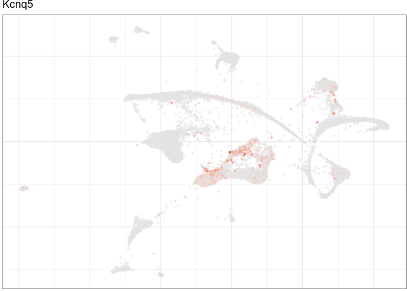
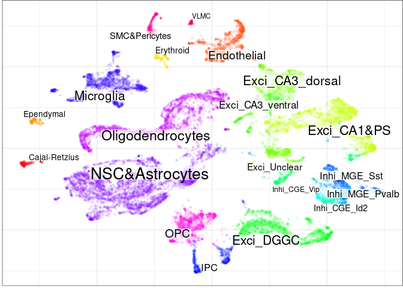
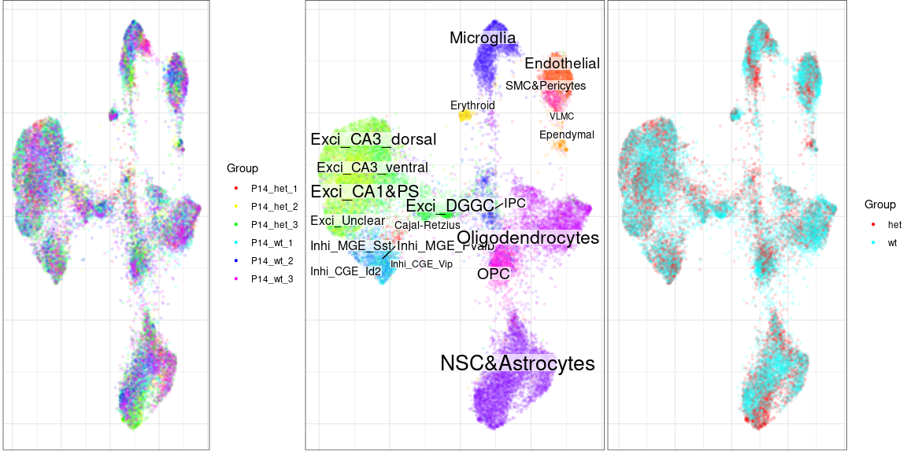

Single-cell RNA-seq datasets processing using Pagoda2 and Conos
================
Xian Xin
2023-03-02

-   <a href="#introduction" id="toc-introduction">Introduction</a>
-   <a href="#package-installation" id="toc-package-installation">Package
    installation</a>
-   <a href="#scrna-seq-data-pre-processing"
    id="toc-scrna-seq-data-pre-processing">scRNA-seq data pre-processing</a>
    -   <a href="#pre-processing-using-pagoda2"
        id="toc-pre-processing-using-pagoda2">Pre-processing using Pagoda2</a>
    -   <a href="#pre-processing-using-seurat"
        id="toc-pre-processing-using-seurat">Pre-processing using Seurat</a>
-   <a href="#datasets-integration" id="toc-datasets-integration">Datasets
    integration</a>
    -   <a href="#building-the-joint-graph"
        id="toc-building-the-joint-graph">Building the joint graph</a>
    -   <a href="#clustering-among-datasets"
        id="toc-clustering-among-datasets">Clustering among datasets</a>
    -   <a href="#generate-embedding-plot"
        id="toc-generate-embedding-plot">Generate embedding plot</a>
-   <a href="#label-propagation" id="toc-label-propagation">Label
    Propagation</a>
-   <a href="#marker-genes-identification"
    id="toc-marker-genes-identification">Marker genes identification</a>
-   <a href="#adjustment-of-conos-alignment-strength"
    id="toc-adjustment-of-conos-alignment-strength">Adjustment of Conos
    alignment strength</a>
-   <a href="#p2app-for-conos" id="toc-p2app-for-conos">P2APP for Conos</a>
    -   <a href="#prepare-metadata-and-count-matrices-for-pagoda2-web-app"
        id="toc-prepare-metadata-and-count-matrices-for-pagoda2-web-app">Prepare
        metadata and count matrices for Pagoda2 web app</a>

## Introduction

-   **What is conos?** [Conos](https://github.com/kharchenkolab/conos)
    is an R package to align a large collections of single-cell RNA-seq
    datasets, which can achieve both the identification of recurrent
    cell clusters and the propagation of information between datasets in
    multi-sample or atlas-scale collections. According to [*Conos*
    document](https://github.com/kharchenkolab/conos), this is how
    *Conos* work for aligning multiple samples/datasets: This package
    applies one of many error-prone methods to align each pair of
    samples in a collection, establishing weighted inter-sample
    cell-to-cell links. The resulting joint graph can then be analyzed
    to identify subpopulations across different samples. Cells of the
    same type will tend to map to each other across many such pairwise
    comparisons, forming cliques that can be recognized as clusters
    (graph communities).

In this tutorial, we will go over the analysis of a list of Scn2a mouse
samples using *Conos*.
[Pagoda2](https://github.com/kharchenkolab/pagoda2) or
[Seurat](https://satijalab.org/seurat/) is also required as *Conos*
needs pre-processed (filtered and normalized) datasets as input. This
vignette is based on [*Conos*
tutorial](https://htmlpreview.github.io/?https://raw.githubusercontent.com/kharchenkolab/conos/main/doc/walkthrough.html).

## Package installation

To install the stable version of *Conos* and *Pagoda2* from *CRAN*, use:

``` r
install.packages(c("conos", "pagoda2"))
```

To install the latest version, use:

``` r
install.packages("devtools")
devtools::install_github("kharchenkolab/conos")
devtools::install_github("kharchenkolab/kharchenkolab/pagoda2")
```

Note that *Conos* and *Pagoad2* also have system dependencies which
require to install by terminal.

Ubuntu dependencies installation:

``` bash
sudo apt-get update
sudo apt-get -y install libcurl4-openssl-dev libssl-dev libxml2-dev libgmp-dev libglpk-dev
```

Red Hat-based distributions dependencies installation:

``` bash
sudo yum update
sudo yum install openssl-devel libcurl-devel libxml2-devel gmp-devel glpk-devel
```

Mac OS dependencies installation:

``` bash
brew update
brew install openssl curl-openssl libxml2 glpk gmp
```

(You may need to run `brew uninstall curl` in order for
`brew install curl-openssl` to be successful.)

We also recommend to install *Seurat* for walking throught every step of
this vignette:

``` r
install.packages("Seurat")
```

## scRNA-seq data pre-processing

``` r
library(conos)
library(dplyr)
library(magrittr)
set.seed(1)
```

Before running *Conos*, we need to load our datasets and pre-process
each dataset using *Pagoda2* or *Seurat.* **Please note:** when starting
with your own datasets, we recommend filtering out
low-count/poor-quality/dying cells, as is standard for quality control.

``` r
cms <- qs::qread("/people/gjl413/data/FORpipeline_example/cms.filtered.qs", nthreads = 32)
str(cms, 1)
```

    ## List of 6
    ##  $ P14_het_1:Formal class 'dgCMatrix' [package "Matrix"] with 6 slots
    ##  $ P14_het_2:Formal class 'dgCMatrix' [package "Matrix"] with 6 slots
    ##  $ P14_het_3:Formal class 'dgCMatrix' [package "Matrix"] with 6 slots
    ##  $ P14_wt_1 :Formal class 'dgCMatrix' [package "Matrix"] with 6 slots
    ##  $ P14_wt_2 :Formal class 'dgCMatrix' [package "Matrix"] with 6 slots
    ##  $ P14_wt_3 :Formal class 'dgCMatrix' [package "Matrix"] with 6 slots

It is very important to make sure that cells from all the datasets are
uniquely named. In this case, the cells have already been prefixed by
sample id. However, in most cases you have to prefix the cells before
continuing.

``` r
head(colnames(cms[[1]]))
```

    ## [1] "P14_het_1!!TTGCCTGCAGCGTGAA-1" "P14_het_1!!TGCTCCAAGCCACTCG-1"
    ## [3] "P14_het_1!!CATCCCAGTCCCTAAA-1" "P14_het_1!!TGCATGAAGGTTGTTC-1"
    ## [5] "P14_het_1!!TGGAACTAGGTCCGAA-1" "P14_het_1!!TGCGACGCATAACTCG-1"

To quickly check that the cell names are unique, we can run:

``` r
any(duplicated(unlist(lapply(cms, colnames))))
```

    ## [1] FALSE

In case you need to rename your cells, you can follow this code chunk to
assign cell name with sample id prefix.

``` r
names.cms <- c("P14_het_1", "P14_het_2", "P14_het_3", 
               "P14_wt_1", "P14_wt_2", "P14_wt_3")
cms <- cms %>%
  setNames(unique(names.mat))
cms %<>% 
  names() %>%
  lapply(function(x) {
    tmp <- cms[[x]] %>%
      `colnames<-`(., sapply(colnames(.), function(y) paste0(x, "_", y)))
  }) %>%
  setNames(cms %>% names())
```

### Pre-processing using Pagoda2

``` r
library(pagoda2)
```

We will generate a list of `Pagoda2` objects from each sample using the
`basicP2proc()` function for quick processing. As the datasets will be
compared to each other, we will turn off automated dropping of
low-expressed genes (`min.cells.per.gene = 0`), and lower the numbers of
local principal components (`PCs`) estimated for faster processing. For
more details about processing single sample using *Pagoda2*, please
refer to [this vignette](./pagoda2.md).

We use `lapply()` here as `cms` is a list with 6 elements (i.e. a panel
of 6 samples). Multiprocessing must be disabled to obtain exactly the
same individual sample embeddings from one run to another: this can be
done by using `set.seed(1)` and specifying `n.cores=1` in the function.

``` r
p2s <- lapply(cms, basicP2proc, 
              n.cores = 1, 
              min.cells.per.gene = 0,
              min.transcripts.per.cell = 0,
              n.odgenes = 2e3, 
              get.largevis = F, 
              make.geneknn = F)
```

    ## creating space of type angular done
    ## adding data ... done
    ## building index ... done
    ## querying ... done
    ## creating space of type angular done
    ## adding data ... done
    ## building index ... done
    ## querying ... done
    ## creating space of type angular done
    ## adding data ... done
    ## building index ... done
    ## querying ... done
    ## creating space of type angular done
    ## adding data ... done
    ## building index ... done
    ## querying ... done
    ## creating space of type angular done
    ## adding data ... done
    ## building index ... done
    ## querying ... done
    ## creating space of type angular done
    ## adding data ... done
    ## building index ... done
    ## querying ... done

We now have a named list of `Pagoda2` objects, which is one of the two
required input formats for *Conos*.

``` r
typeof(p2s)
```

    ## [1] "list"

``` r
names(p2s)
```

    ## [1] "P14_het_1" "P14_het_2" "P14_het_3" "P14_wt_1"  "P14_wt_2"  "P14_wt_3"

### Pre-processing using Seurat

Alternatively for *Seurat* users, pre-processing can be done in a
similar way using an `basicSeuratProc()` function. If you already have a
list of `Seurat` objects (one per dataset), you can skip this step and
apply them directly to `Conos$new()`.

``` r
library(Seurat)
```

``` r
seus <- lapply(cms, basicSeuratProc)
```

    ## Modularity Optimizer version 1.3.0 by Ludo Waltman and Nees Jan van Eck
    ## 
    ## Number of nodes: 1751
    ## Number of edges: 54876
    ## 
    ## Running Louvain algorithm...
    ## Maximum modularity in 10 random starts: 0.9094
    ## Number of communities: 15
    ## Elapsed time: 0 seconds
    ## Modularity Optimizer version 1.3.0 by Ludo Waltman and Nees Jan van Eck
    ## 
    ## Number of nodes: 2475
    ## Number of edges: 91883
    ## 
    ## Running Louvain algorithm...
    ## Maximum modularity in 10 random starts: 0.9172
    ## Number of communities: 22
    ## Elapsed time: 0 seconds
    ## Modularity Optimizer version 1.3.0 by Ludo Waltman and Nees Jan van Eck
    ## 
    ## Number of nodes: 4703
    ## Number of edges: 258609
    ## 
    ## Running Louvain algorithm...
    ## Maximum modularity in 10 random starts: 0.8947
    ## Number of communities: 22
    ## Elapsed time: 0 seconds
    ## Modularity Optimizer version 1.3.0 by Ludo Waltman and Nees Jan van Eck
    ## 
    ## Number of nodes: 3853
    ## Number of edges: 144974
    ## 
    ## Running Louvain algorithm...
    ## Maximum modularity in 10 random starts: 0.9156
    ## Number of communities: 25
    ## Elapsed time: 0 seconds
    ## Modularity Optimizer version 1.3.0 by Ludo Waltman and Nees Jan van Eck
    ## 
    ## Number of nodes: 2386
    ## Number of edges: 86055
    ## 
    ## Running Louvain algorithm...
    ## Maximum modularity in 10 random starts: 0.9141
    ## Number of communities: 20
    ## Elapsed time: 0 seconds
    ## Modularity Optimizer version 1.3.0 by Ludo Waltman and Nees Jan van Eck
    ## 
    ## Number of nodes: 4334
    ## Number of edges: 184860
    ## 
    ## Running Louvain algorithm...
    ## Maximum modularity in 10 random starts: 0.9210
    ## Number of communities: 22
    ## Elapsed time: 0 seconds

``` r
typeof(seus)
```

    ## [1] "list"

``` r
names(seus)
```

    ## [1] "P14_het_1" "P14_het_2" "P14_het_3" "P14_wt_1"  "P14_wt_2"  "P14_wt_3"

## Datasets integration

We will construct a `Conos` object for this list of samples. We
recommend to set the `n.cores` parameter, because the joint graph
building with *Conos* can take advantage of parallel processing.

``` r
con <- Conos$new(p2s, n.cores = 32)
```

### Building the joint graph

Next we will build the joint graph encompassing all samples. *Conos*
achieve this by pairwise projecting samples onto a common `space` and
establishing the k-nearest neighbors (kNN) of mutual nearest neighbor
(mNN) pairs between samples. Then it appends within-sample k-nearest
neighbors to the graph to ensure that all of the cells are included in
the graph:

-   “PCA” space (default) is very fast and can yield good integration in
    most cases.

-   “CPCA” space should provide more accurate alignment under greater
    dataset-specific distortions.

-   “CCA” space optimizes conservation of correlation between datasets
    and can give yield very good alignments in low-similarity cases
    (e.g. large evolutionary distances).

-   If your datasets were all measured on the same platform you may also
    want to consider “genes” space which can give better resolution in
    such (simpler) cases.

-   You can check `$buildGraph()` helper document using `?Conos` for
    more detailed information

``` r
con$buildGraph(space = "PCA", 
               score.component.variance = T,
               alignment.strength = NULL, 
               balancing.factor.per.cell = NULL, 
               same.factor.downweight = 1)
```

    ## .

As pairwise comparisons may take a while, *Conos* will cache results for
each space. If you wish to recalculate PCA (as an example) using
pairings with different set of parameters (e.g. more components,
different number of starting over-dispersed genes, etc.), clear the
cache first by doing `con$pairs$PCA <- NULL`.

In `$buildGraph()`, we also specified `score.component.variance = T`
which estimates the amount of variance explained by successive PCs (by
default this is off to save time). We can visualize the results using:

``` r
plotComponentVariance(con, space = "PCA")
```

<!-- -->

When using the “angular” distance measure (default), it is not
recommended to reduce the number of components to a bare minimum
indicated by the “elbow” inflection point. Please include 10-20 more
(typically 30 components work well). For the ‘L2’ distance, using fewer
components (i.e. at ‘elbow’ value) is sometimes better.

We can now plot a panel of these samples using the clusters identified
in each sample. Please note that each sample has an independent set of
clusters that has no relation to clusters in other samples.

``` r
con$plotPanel(clustering = "multilevel", 
              use.local.clusters = T, 
              title.size = 6)
```

<!-- -->

### Clustering among datasets

We now use the joint graph to get the global clusters. Here we use the
[Leiden community detection
method](https://www.nature.com/articles/s41598-019-41695-z) to obtain
clusters. Increasing the value of the `resolution` parameter will result
in more fine-grained clusters, while decreasing it will return coarser
clustering:

``` r
con$findCommunities(method = leiden.community, resolution = 1)
```

We can now plot the clusters we obtained. Please note that the index
number of clusters between different samples now corresponds to the same
cell type.

``` r
con$plotPanel(font.size = 4, clustering = "leiden")
```

<!-- -->

The convenience function `plotClusterBarplots()` can be used to examine
the composition of the clusters in terms of samples, sample entropy, and
cluster size:

``` r
plotClusterBarplots(con, clustering = "leiden", legend.height = 0.1)
```

<!-- -->

Next we can check the expression pattern of a specific gene across all
the individual embeddings. In this case, we investigate the expression
pattern of “Kcnq5”:

``` r
con$plotPanel(gene = "Kcnq5")
```

<!-- -->

Other community detection methods can provide a more sensitive and
hierarchical view of the subpopulation structure. Here we run the
[igraph walktrap
community](https://www.rdocumentation.org/packages/igraph/versions/0.5.1/topics/walktrap.community)
detection method on the same joint graph:

``` r
con$findCommunities(method = igraph::walktrap.community, steps = 7)
```

``` r
con$plotPanel(font.size = 4, clustering = "walktrap")
```

<!-- -->

We recommend using a higher number of `steps` (e.g. 8-10, though these
calculations take much longer). Here we’ll get a lot of smaller
clusters.

Different clustering results are kept as a simple list under
`con$clusters`.

### Generate embedding plot

Next we will generate an embedding of the joint graph (the default
`method` uses “largeVis”):

``` r
con$embedGraph(method = "largeVis")
```

And now we can create the global embedding plot:

``` r
con$plotGraph(embedding = "largeVis", clustering = "leiden", alpha = 0.1)
```

<!-- -->

Both functions `$plotGraph()` and `$plotPanel()` are constructed off of
the main function `sccore::embeddingPlot()` and will pass all
visualization parameters to this main function. So, to get full list of
the possible parameters please refer to `?sccore::embeddingPlot`.

The graph can capture the population structure irrespective of the
sample of origin for each cell:

``` r
con$plotGraph(embedding = "largeVis", color.by = "sample", mark.groups = F, alpha = 0.1, show.legend = T)
```

<!-- -->

We can also visualize gene expression on this joint graph embedding:

``` r
con$plotGraph(embedding = "largeVis", gene = "Kcnq5", title = "Kcnq5")
```

<!-- -->

Conos currently supports to use two methods of graph embedding:
[largeVis](https://github.com/lferry007/LargeVis) (default) and
[UMAP](https://github.com/jlmelville/uwot). The UMAP embedding takes a
bit longer to estimate, but will generally give a better quality of the
embedding. It is better to examine both types of embeddings.

The UMAP embedding supports all parameters, as described in the
[uwot](https://github.com/jlmelville/uwot) package. The two most
important ones are `spread` and `min.dist`, which together control how
tight the clusters are. According to the [python
manual](https://umap-learn.readthedocs.io/en/latest/api.html):

-   `min.dist`: The effective minimum distance between embedded points.
    Smaller values will result in a more clustered/clumped embedding
    where nearby points on the manifold are drawn closer together, while
    larger values will result on a more even dispersal of points. The
    value should be set relative to the spread value, which determines
    the scale at which embedded points will be spread out.

-   `spread`: The effective scale of embedded points. In combination
    with `min_dist` this determines how clustered/clumped the embedded
    points are.

There is also a parameter responsible for the trade-off between
performance and accuracy:

\+`min.prob.lower`: minimal probability of hitting a neighbor, after
which the random walk stops. Default: 1e-7.

``` r
con$embedGraph(method = "UMAP", 
               min.dist = 0.01, 
               spread = 15, 
               min.prob.lower = 1e-3)
```

    ## Estimating hitting distances: 02:39:31.
    ## Done.
    ## Estimating commute distances: 02:39:31.
    ## Hashing adjacency list: 02:39:31.
    ## Done.
    ## Estimating distances: 02:39:32.
    ## Done
    ## Done.
    ## All done!: 02:39:34.

``` r
con$plotGraph(embedding = "UMAP", clustering = "leiden", alpha = 0.1)
```

<!-- -->

We can use this common embedding in `plotPanel()` as well:

``` r
con$plotPanel(clustering = "leiden", size = 0.1, use.common.embedding = T, embedding = "UMAP")
```

<!-- -->

## Label Propagation

One of the uses of this graph is to propagate cell labels/annotations.
For example, in some cases we will only have information about the cell
types in some of the samples and we will want to automatically label the
other samples.

We’ll load the annotation from a vector of named factors and visulize in
embedding plots:

``` r
cell.anno <- readRDS("/people/gjl413/data/FORpipeline_example/cell.anno.rds")
head(cell.anno)
```

    ## P14_het_1!!TTGCCTGCAGCGTGAA-1 P14_het_1!!TGCTCCAAGCCACTCG-1 
    ##                  Inhi_CGE_Id2               Exci_CA3_dorsal 
    ## P14_het_1!!CATCCCAGTCCCTAAA-1 P14_het_1!!TGCATGAAGGTTGTTC-1 
    ##               Exci_CA3_dorsal                  Inhi_MGE_Sst 
    ## P14_het_1!!TGGAACTAGGTCCGAA-1 P14_het_1!!TGCGACGCATAACTCG-1 
    ##                   Endothelial               Exci_CA3_dorsal 
    ## 20 Levels: Cajal-Retzius Endothelial Ependymal Erythroid ... VLMC

``` r
con$plotGraph(groups = cell.anno, embedding = "UMAP", alpha = 0.1)
```

<!-- -->

``` r
con$plotPanel(groups = cell.anno, use.common.embedding = T, embedding = "UMAP")
```

<!-- -->

Next we plot our panel with the subset of annotations we made. This is
to verify that the annotated cells are indeed in some samples and that
the other samples are unlabelled.

``` r
cell.anno.het <- cell.anno[startsWith(names(cell.anno), "P14_het")]
```

``` r
con$plotGraph(groups = cell.anno.het, embedding = "UMAP", alpha = 0.1)
```

<!-- -->

``` r
con$plotPanel(groups = cell.anno.het, use.common.embedding = T, embedding = "UMAP")
```

<!-- -->

Next let’s propagate the labels from the annotated samples to the
others.

``` r
new.label <- con$propagateLabels(labels = cell.anno.het)
```

    ## Stop after 20 iterations. Norm: 0.0249832
    ## Min weight: 1.67017e-05, max weight: 0.367879, fading: (10, 0.1)

This function returns probabilities, uncertainty scores, and final
labels in the dataset of each cell belonging to each group:

``` r
con$plotGraph(groups = new.label$labels, embedding = "UMAP", alpha = 0.1)
```

<!-- -->

``` r
con$plotPanel(groups = new.label$labels, use.common.embedding = T, embedding = "UMAP")
```

<!-- -->

``` r
con$plotPanel(colors = new.label$uncertainty, show.legend = T, legend.title = "Uncertainty", legend.pos = c(1, 0), use.common.embedding = T, embedding = "UMAP")
```

<!-- -->

``` r
tail(new.label$label.distribution)
```

    ##                              Inhi_CGE_Id2 Exci_CA3_dorsal Inhi_MGE_Sst
    ## P14_wt_3!!TAGTGCAGTATGTCTG-1 1.060024e-21    4.601547e-20 3.407822e-21
    ## P14_wt_3!!CAGCACGTCACTACTT-1 2.662131e-22    9.063513e-20 1.020244e-21
    ## P14_wt_3!!CACTGGGAGCCTTCTC-1 1.460246e-22    4.956913e-20 5.594966e-22
    ## P14_wt_3!!AGATCCAGTTGGGACA-1 2.305638e-22    7.861381e-20 8.837918e-22
    ## P14_wt_3!!CCACAAAGTCAGCGTC-1 2.196760e-22    7.492681e-20 8.420828e-22
    ## P14_wt_3!!AGTGACTTCTGTCGCT-1 1.167620e-22    3.990839e-20 4.477212e-22
    ##                               Endothelial Inhi_MGE_Pvalb Exci_CA3_ventral
    ## P14_wt_3!!TAGTGCAGTATGTCTG-1 2.468164e-09   3.585381e-21     3.507817e-14
    ## P14_wt_3!!CAGCACGTCACTACTT-1 8.024698e-09   1.034517e-21     3.673213e-16
    ## P14_wt_3!!CACTGGGAGCCTTCTC-1 4.384497e-09   5.673519e-22     4.372438e-16
    ## P14_wt_3!!AGATCCAGTTGGGACA-1 6.967546e-09   8.961284e-22     4.053073e-16
    ## P14_wt_3!!CCACAAAGTCAGCGTC-1 6.631457e-09   8.538290e-22     5.399810e-16
    ## P14_wt_3!!AGTGACTTCTGTCGCT-1 3.531055e-09   4.539550e-22     8.152049e-16
    ##                               Exci_CA1&PS Oligodendrocytes Inhi_CGE_Vip
    ## P14_wt_3!!TAGTGCAGTATGTCTG-1 1.123701e-20     1.778227e-15 1.473475e-22
    ## P14_wt_3!!CAGCACGTCACTACTT-1 3.180629e-21     5.714636e-15 3.681863e-23
    ## P14_wt_3!!CACTGGGAGCCTTCTC-1 1.833431e-21     3.124188e-15 2.019609e-23
    ## P14_wt_3!!AGATCCAGTTGGGACA-1 2.796275e-21     4.957487e-15 3.188799e-23
    ## P14_wt_3!!CCACAAAGTCAGCGTC-1 2.716375e-21     4.724974e-15 3.038214e-23
    ## P14_wt_3!!AGTGACTTCTGTCGCT-1 1.623416e-21     2.513609e-15 1.614854e-23
    ##                                 Exci_DGGC    Ependymal          IPC Microglia
    ## P14_wt_3!!TAGTGCAGTATGTCTG-1 1.313631e-17 1.713754e-18 3.051993e-14         1
    ## P14_wt_3!!CAGCACGTCACTACTT-1 2.933787e-18 6.240617e-19 9.924101e-14         1
    ## P14_wt_3!!CACTGGGAGCCTTCTC-1 1.663340e-18 3.423675e-19 5.422619e-14         1
    ## P14_wt_3!!AGATCCAGTTGGGACA-1 2.567026e-18 5.407289e-19 8.615969e-14         1
    ## P14_wt_3!!CCACAAAGTCAGCGTC-1 2.477227e-18 5.151965e-19 8.205264e-14         1
    ## P14_wt_3!!AGTGACTTCTGTCGCT-1 1.437910e-18 2.741172e-19 4.363484e-14         1
    ##                              NSC&Astrocytes Cajal-Retzius          OPC
    ## P14_wt_3!!TAGTGCAGTATGTCTG-1   1.432544e-15  2.593721e-27 1.424784e-18
    ## P14_wt_3!!CAGCACGTCACTACTT-1   4.411979e-15  4.670614e-28 9.029940e-21
    ## P14_wt_3!!CACTGGGAGCCTTCTC-1   2.411238e-15  2.564581e-28 5.630696e-21
    ## P14_wt_3!!AGATCCAGTTGGGACA-1   3.827433e-15  4.044073e-28 7.481838e-21
    ## P14_wt_3!!CCACAAAGTCAGCGTC-1   3.646824e-15  3.851941e-28 7.237366e-21
    ## P14_wt_3!!AGTGACTTCTGTCGCT-1   1.939641e-15  2.046379e-28 3.983250e-21
    ##                                      VLMC SMC&Pericytes Exci_Unclear
    ## P14_wt_3!!TAGTGCAGTATGTCTG-1 6.871979e-21  5.295714e-20 4.645005e-21
    ## P14_wt_3!!CAGCACGTCACTACTT-1 1.976164e-20  1.438146e-19 1.488144e-22
    ## P14_wt_3!!CACTGGGAGCCTTCTC-1 1.039489e-20  7.455060e-20 1.421868e-22
    ## P14_wt_3!!AGATCCAGTTGGGACA-1 1.881127e-20  1.426257e-19 1.544884e-22
    ## P14_wt_3!!CCACAAAGTCAGCGTC-1 1.263767e-20  7.949290e-20 1.808303e-22
    ## P14_wt_3!!AGTGACTTCTGTCGCT-1 1.211875e-20  1.005191e-19 2.127452e-22
    ##                                 Erythroid
    ## P14_wt_3!!TAGTGCAGTATGTCTG-1 6.320981e-21
    ## P14_wt_3!!CAGCACGTCACTACTT-1 7.345749e-21
    ## P14_wt_3!!CACTGGGAGCCTTCTC-1 4.230598e-21
    ## P14_wt_3!!AGATCCAGTTGGGACA-1 6.366830e-21
    ## P14_wt_3!!CCACAAAGTCAGCGTC-1 6.339607e-21
    ## P14_wt_3!!AGTGACTTCTGTCGCT-1 3.471498e-21

## Marker genes identification

The first step we can do to understand meaning of the datasets is to
look at the cluster marker genes:

``` r
leiden.marker <- con$getDifferentialGenes(clustering = "leiden", append.auc = T, groups = con$clusters$leiden$groups, upregulated.only = F)
```

``` r
head(leiden.marker$`1`)
```

    ##            Gene        M        Z        PValue          PAdj       AUC
    ## Apoe       Apoe 1.987426 36.44946 1.279834e-289 4.131945e-285 0.8168765
    ## Slc1a2   Slc1a2 2.013349 36.18320 2.025882e-285 6.540356e-281 0.7470173
    ## Slc1a3   Slc1a3 2.254105 35.88627 8.981021e-281 2.899343e-276 0.8937040
    ## Aldoc     Aldoc 2.279986 35.87596 1.300150e-280 4.197145e-276 0.9023034
    ## Clu         Clu 2.120186 35.86321 2.054286e-280 6.631441e-276 0.7857714
    ## Sparcl1 Sparcl1 1.772912 35.68192 1.346353e-277 4.346029e-273 0.7347746
    ##         Specificity Precision ExpressionFraction
    ## Apoe      0.6337529 0.3894337          1.0000000
    ## Slc1a2    0.4970605 0.3164361          0.9972922
    ## Slc1a3    0.8114383 0.5462528          0.9769835
    ## Aldoc     0.8226548 0.5631595          0.9826699
    ## Clu       0.5857981 0.3568981          0.9870024
    ## Sparcl1   0.4759318 0.3068182          0.9943136

And we can plot a heatmap of the top genes (top by AUC, by default)

``` r
plotDEheatmap(con, groups = as.factor(con$clusters$leiden$groups), 
              de = leiden.marker, n.genes.per.cluster = 5, 
              column.metadata=list(samples=con$getDatasetPerCell()), 
              row.label.font.size = 7)
```

<!-- -->

## Adjustment of Conos alignment strength

In many cases, different samples form separate subclusters within the
clusters of major cell types. Conos allows users to force better
alignment through adjustment of the `alignment.strength parameter` which
can be varied in \[0; 1\] range (default: 0), or through re-balancing of
edge weights based on a specific factor (e.g. genotype to which the cell
belongs) using the `balance.edge.weights` parameter.

``` r
genotype.info <- con$getDatasetPerCell() %>% stringr::str_extract("het|wt") %>% setNames(names(con$getDatasetPerCell()))

head(genotype.info)
```

    ## P14_het_1!!TTGCCTGCAGCGTGAA-1 P14_het_1!!TGCTCCAAGCCACTCG-1 
    ##                         "het"                         "het" 
    ## P14_het_1!!CATCCCAGTCCCTAAA-1 P14_het_1!!TGCATGAAGGTTGTTC-1 
    ##                         "het"                         "het" 
    ## P14_het_1!!TGGAACTAGGTCCGAA-1 P14_het_1!!TGCGACGCATAACTCG-1 
    ##                         "het"                         "het"

``` r
cowplot::plot_grid(con$plotGraph(embedding = "UMAP", color.by = "sample", mark.groups = F, alpha = 0.1, show.legend = T), 
                   con$plotGraph(groups = cell.anno, embedding = "UMAP", alpha = 0.1), 
                   con$plotGraph(groups = genotype.info, embedding = "UMAP", mark.groups = F, alpha = 0.1, show.legend = T),
                   nrow = 1)
```

<!-- -->

``` r
con$buildGraph(space = "PCA", 
               score.component.variance = T,
               alignment.strength = 0.3, 
               balancing.factor.per.cell = NULL, 
               same.factor.downweight = 1)
```

    ## .

``` r
con$embedGraph(embedding.name = "second_embedding", 
               method = "UMAP", 
               min.dist = 0.01, 
               spread = 15, 
               min.prob.lower = 1e-3)
```

    ## Estimating hitting distances: 02:42:25.
    ## Done.
    ## Estimating commute distances: 02:42:26.
    ## Hashing adjacency list: 02:42:26.
    ## Done.
    ## Estimating distances: 02:42:28.
    ## Done
    ## Done.
    ## All done!: 02:42:32.

``` r
cowplot::plot_grid(con$plotGraph(embedding = "second_embedding", color.by = "sample", mark.groups = F, alpha = 0.1, show.legend = T), 
                   con$plotGraph(groups = cell.anno, embedding = "second_embedding", alpha = 0.1), 
                   con$plotGraph(groups = genotype.info, embedding = "second_embedding", mark.groups = F, alpha = 0.1, show.legend = T),
                   nrow = 1)
```

<!-- -->

Though, be aware that larger values of `alignment.strength` lead to
worse cluster separation:

``` r
con$buildGraph(space = "PCA", 
               score.component.variance = T,
               alignment.strength = 0.6, 
               balancing.factor.per.cell = NULL, 
               same.factor.downweight = 1)
```

    ## .

``` r
con$embedGraph(embedding.name = "third_embedding", 
               method = "UMAP", 
               min.dist = 0.01, 
               spread = 15, 
               min.prob.lower = 1e-3)
```

    ## Estimating hitting distances: 02:43:24.
    ## Done.
    ## Estimating commute distances: 02:43:25.
    ## Hashing adjacency list: 02:43:25.
    ## Done.
    ## Estimating distances: 02:43:27.
    ## Done
    ## Done.
    ## All done!: 02:43:36.

``` r
cowplot::plot_grid(con$plotGraph(embedding = "third_embedding", color.by = "sample", mark.groups = F, alpha = 0.1, show.legend = T), 
                   con$plotGraph(groups = cell.anno, embedding = "third_embedding", alpha = 0.1), 
                   con$plotGraph(groups = genotype.info, embedding = "third_embedding", mark.groups = F, alpha = 0.1, show.legend = T),
                   nrow = 1)
```

<!-- -->

And the most extreme case actually “aligns” all clusters and datasets
together:

``` r
con$buildGraph(space = "PCA", 
               score.component.variance = T,
               alignment.strength = 1, 
               balancing.factor.per.cell = NULL, 
               same.factor.downweight = 1)
```

    ## .

``` r
con$embedGraph(embedding.name = "fourth_embedding", 
               method = "UMAP", 
               min.dist = 0.01, 
               spread = 15, 
               min.prob.lower = 1e-3)
```

    ## Estimating hitting distances: 02:44:26.
    ## Done.
    ## Estimating commute distances: 02:44:28.
    ## Hashing adjacency list: 02:44:28.
    ## Done.
    ## Estimating distances: 02:44:29.
    ## Done
    ## Done.
    ## All done!: 02:44:38.

``` r
cowplot::plot_grid(con$plotGraph(embedding = "fourth_embedding", color.by = "sample", mark.groups = F, alpha = 0.1, show.legend = T), 
                   con$plotGraph(groups = cell.anno, embedding = "fourth_embedding", alpha = 0.1), 
                   con$plotGraph(groups = genotype.info, embedding = "fourth_embedding", mark.groups = F, alpha = 0.1, show.legend = T),
                   nrow = 1)
```

<!-- -->

Still, this procedure isn’t explicitly aware about conditions which
cause differences in datasets. And sometimes the above procedure allows
datasets to group together, even with the most “aggressive” alignment.

To overcome this issue, which connect cells within the same condition.
The parameter which determines the multiplication coefficient is called
`same.factor.downweight`, and it also requires you to pass information
about the conditions to `balancing.factor.per.cell`. Please keep in mind
that down-weighting of within-genotype edges does not help if there are
no between-tissue edges. So it’s recommended to use the
`same.factor.downweight` parameter together with `alignment.strength`.

``` r
con$buildGraph(space = "PCA", 
               score.component.variance = T,
               alignment.strength = 0.3, 
               balancing.factor.per.cell = genotype.info, 
               same.factor.downweight = 0.1)
```

    ## .

``` r
con$embedGraph(embedding.name = "fifth_embedding", 
               method = "UMAP", 
               min.dist = 0.01, 
               spread = 15, 
               min.prob.lower = 1e-3)
```

    ## Estimating hitting distances: 02:45:24.
    ## Done.
    ## Estimating commute distances: 02:45:25.
    ## Hashing adjacency list: 02:45:25.
    ## Done.
    ## Estimating distances: 02:45:26.
    ## Done
    ## Done.
    ## All done!: 02:45:31.

``` r
cowplot::plot_grid(con$plotGraph(embedding = "fifth_embedding", color.by = "sample", mark.groups = F, alpha = 0.1, show.legend = T), 
                   con$plotGraph(groups = cell.anno, embedding = "fifth_embedding", alpha = 0.1), 
                   con$plotGraph(groups = genotype.info, embedding = "fifth_embedding", mark.groups = F, alpha = 0.1, show.legend = T),
                   nrow = 1)
```

<!-- -->

## P2APP for Conos

We can also interactively explore `Conos` objects in the
[Pagoda2](https://github.com/kharchenkolab/pagoda2) web application. The
process is very similar to the [Pagoda2
walkthrough](https://htmlpreview.github.io/?https://raw.githubusercontent.com/kharchenkolab/pagoda2/main/doc/pagoda2.walkthrough.html).

### Prepare metadata and count matrices for Pagoda2 web app

``` r
cm.merge <- conos:::mergeCountMatrices(cms = cms, transposed = F)
```

``` r
p2metadata <- list()

p2metadata$genotype <- colnames(cm.merge) %>% stringr::str_extract("het|wt") %>% factor() %>% setNames(colnames(cm.merge))
p2metadata$sample <- con$getDatasetPerCell()[match(colnames(cm.merge), names(con$getDatasetPerCell()))]
p2metadata$cluster <- con$clusters$leiden$groups[match(colnames(cm.merge), names(con$clusters$leiden$groups))]
p2metadata$anno <- cell.anno[match(colnames(cm.merge), names(cell.anno))]

p2metadata <- factorListToMetadata(p2metadata)
```

Generate Pagoda2 web application bin file and open in browser

``` r
# Generate Pagoda2 web app
p2.web <- basicP2proc(cm.merge, min.transcripts.per.cell = 500, n.cores = 32, min.cells.per.gene = 3, nPcs = 50, get.largevis = F, get.tsne = F)
p2.web <- extendedP2proc(p2.web, organism = "mm")
go.env <- p2.web$go.env
p2.web <- p2.web$p2
p2.web.app <- webP2proc(p2.web, additionalMetadata = p2metadata, title = 'P14_WebApp', go.env = go.env, make.go.sets = F)

# Add UMAP embedding
p2.web.app$originalP2object$embeddings$PCA[["UMAP"]] <- con$embeddings$UMAP

# Generate dendrogram by Conos clusters
p2.web.app$mainDendrogram <- p2.web.app$generateDendrogramOfGroups(r = p2.web, dendrogramCellGroups = con$clusters$leiden$groups[match(colnames(cm.merge), names(con$clusters$leiden$groups))])

# Create .bin-file
p2.web.app$serializeToStaticFast("P4WebApp.bin",verbose = T)
# We can show it in browser
show.app(app = p2.web.app, name = 'P14_WebApp')
```

``` r
sessionInfo()
```

    ## R version 4.2.2 (2022-10-31)
    ## Platform: x86_64-pc-linux-gnu (64-bit)
    ## Running under: Red Hat Enterprise Linux 8.7 (Ootpa)
    ## 
    ## Matrix products: default
    ## BLAS:   /usr/local/R-4.2.2/lib64/R/lib/libRblas.so
    ## LAPACK: /usr/local/R-4.2.2/lib64/R/lib/libRlapack.so
    ## 
    ## locale:
    ##  [1] LC_CTYPE=en_US.UTF-8       LC_NUMERIC=C              
    ##  [3] LC_TIME=en_US.UTF-8        LC_COLLATE=en_US.UTF-8    
    ##  [5] LC_MONETARY=en_US.UTF-8    LC_MESSAGES=en_US.UTF-8   
    ##  [7] LC_PAPER=en_US.UTF-8       LC_NAME=C                 
    ##  [9] LC_ADDRESS=C               LC_TELEPHONE=C            
    ## [11] LC_MEASUREMENT=en_US.UTF-8 LC_IDENTIFICATION=C       
    ## 
    ## attached base packages:
    ## [1] stats     graphics  grDevices utils     datasets  methods   base     
    ## 
    ## other attached packages:
    ## [1] SeuratObject_4.1.3 Seurat_4.3.0       pagoda2_1.0.10     magrittr_2.0.3    
    ## [5] dplyr_1.1.0        conos_1.5.0        igraph_1.3.5       Matrix_1.5-3      
    ## 
    ## loaded via a namespace (and not attached):
    ##   [1] N2R_1.0.1              circlize_0.4.15        plyr_1.8.8            
    ##   [4] lazyeval_0.2.2         sp_1.6-0               splines_4.2.2         
    ##   [7] entropy_1.3.1          RApiSerialize_0.1.2    listenv_0.9.0         
    ##  [10] scattermore_0.8        ggplot2_3.4.0          urltools_1.7.3        
    ##  [13] digest_0.6.31          foreach_1.5.2          htmltools_0.5.4       
    ##  [16] fansi_1.0.4            RMTstat_0.3.1          tensor_1.5            
    ##  [19] cluster_2.1.4          doParallel_1.0.17      ROCR_1.0-11           
    ##  [22] ComplexHeatmap_2.14.0  globals_0.16.2         RcppParallel_5.1.6    
    ##  [25] matrixStats_0.63.0     R.utils_2.12.2         spatstat.sparse_3.0-0 
    ##  [28] sccore_1.0.3           colorspace_2.1-0       ggrepel_0.9.2         
    ##  [31] xfun_0.37              crayon_1.5.2           jsonlite_1.8.4        
    ##  [34] progressr_0.13.0       spatstat.data_3.0-0    stringfish_0.15.7     
    ##  [37] brew_1.0-8             survival_3.4-0         zoo_1.8-11            
    ##  [40] iterators_1.0.14       glue_1.6.2             polyclip_1.10-4       
    ##  [43] gtable_0.3.1           leiden_0.4.3           GetoptLong_1.0.5      
    ##  [46] leidenAlg_1.0.5        Rook_1.2               future.apply_1.10.0   
    ##  [49] shape_1.4.6            BiocGenerics_0.44.0    abind_1.4-5           
    ##  [52] scales_1.2.1           DBI_1.1.3              spatstat.random_3.1-3 
    ##  [55] miniUI_0.1.1.1         Rcpp_1.0.10            viridisLite_0.4.1     
    ##  [58] xtable_1.8-4           clue_0.3-64            reticulate_1.28       
    ##  [61] stats4_4.2.2           htmlwidgets_1.6.1      httr_1.4.4            
    ##  [64] RColorBrewer_1.1-3     ellipsis_0.3.2         ica_1.0-3             
    ##  [67] farver_2.1.1           pkgconfig_2.0.3        R.methodsS3_1.8.2     
    ##  [70] uwot_0.1.14            deldir_1.0-6           utf8_1.2.3            
    ##  [73] labeling_0.4.2         tidyselect_1.2.0       rlang_1.0.6           
    ##  [76] reshape2_1.4.4         later_1.3.0            pbmcapply_1.5.1       
    ##  [79] munsell_0.5.0          tools_4.2.2            cli_3.6.0             
    ##  [82] generics_0.1.3         ggridges_0.5.4         evaluate_0.20         
    ##  [85] stringr_1.5.0          fastmap_1.1.0          goftest_1.2-3         
    ##  [88] yaml_2.3.7             knitr_1.42             fitdistrplus_1.1-8    
    ##  [91] purrr_1.0.1            RANN_2.6.1             pbapply_1.7-0         
    ##  [94] future_1.31.0          nlme_3.1-160           mime_0.12             
    ##  [97] R.oo_1.25.0            compiler_4.2.2         rstudioapi_0.14       
    ## [100] plotly_4.10.1          png_0.1-8              spatstat.utils_3.0-1  
    ## [103] tibble_3.1.8           stringi_1.7.12         highr_0.10            
    ## [106] drat_0.2.3             lattice_0.20-45        vctrs_0.5.2           
    ## [109] pillar_1.8.1           lifecycle_1.0.3        spatstat.geom_3.0-6   
    ## [112] triebeard_0.3.0        lmtest_0.9-40          GlobalOptions_0.1.2   
    ## [115] RcppAnnoy_0.0.20       data.table_1.14.6      cowplot_1.1.1         
    ## [118] irlba_2.3.5.1          httpuv_1.6.8           patchwork_1.1.2       
    ## [121] R6_2.5.1               qs_0.25.4              promises_1.2.0.1      
    ## [124] KernSmooth_2.23-20     gridExtra_2.3          IRanges_2.32.0        
    ## [127] parallelly_1.34.0      codetools_0.2-18       MASS_7.3-58.1         
    ## [130] rjson_0.2.21           withr_2.5.0            sctransform_0.3.5     
    ## [133] S4Vectors_0.36.1       mgcv_1.8-41            parallel_4.2.2        
    ## [136] grid_4.2.2             tidyr_1.3.0            rmarkdown_2.20        
    ## [139] dendsort_0.3.4         Cairo_1.6-0            Rtsne_0.16            
    ## [142] spatstat.explore_3.0-6 shiny_1.7.4
