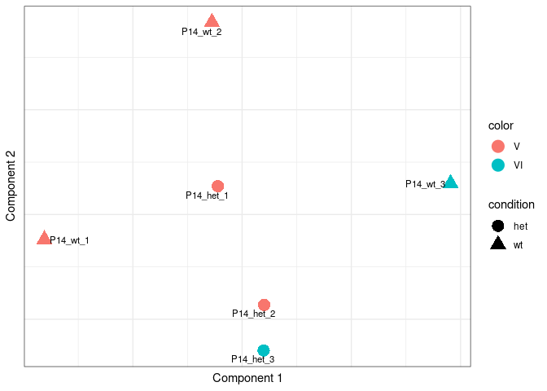

Comparative analysis between groups of scRNA-seq samples using Cacoa
================
Xian Xin
2023-03-02

-   <a href="#introduction" id="toc-introduction">Introduction</a>
-   <a href="#package-installation" id="toc-package-installation">Package
    installation</a>
-   <a href="#load-data-and-intialise-cacoa"
    id="toc-load-data-and-intialise-cacoa">Load data and intialise Cacoa</a>
    -   <a href="#no-expression-data" id="toc-no-expression-data">No expression
        data</a>
    -   <a href="#raw-or-normalized-joint-count-matrix-cm"
        id="toc-raw-or-normalized-joint-count-matrix-cm">Raw or normalized joint
        count matrix <code>cm</code></a>
    -   <a href="#seurat-object-so" id="toc-seurat-object-so">Seurat object
        <code>so</code></a>
    -   <a href="#conos-object-co" id="toc-conos-object-co">Conos object
        <code>co</code></a>
-   <a href="#philosophy-of-cacoa-usage"
    id="toc-philosophy-of-cacoa-usage">Philosophy of Cacoa usage</a>
-   <a href="#cluster-based-analysis"
    id="toc-cluster-based-analysis">Cluster-based analysis</a>
    -   <a href="#compositional-changes"
        id="toc-compositional-changes">Compositional changes</a>
    -   <a href="#expression-shifts" id="toc-expression-shifts">Expression
        shifts</a>
    -   <a href="#sample-structure-and-covariate-correction"
        id="toc-sample-structure-and-covariate-correction">Sample structure and
        covariate correction</a>
    -   <a href="#de" id="toc-de">DE</a>
-   <a href="#cluster-free-analysis"
    id="toc-cluster-free-analysis">Cluster-free analysis</a>
    -   <a href="#compositional-changes-1"
        id="toc-compositional-changes-1">Compositional changes</a>
    -   <a href="#expression-shifts-1" id="toc-expression-shifts-1">Expression
        shifts</a>
    -   <a href="#de-1" id="toc-de-1">DE</a>

## Introduction

When processing scRNA-seq data from multiple conditions, we usually need
to perform comparisons (expression and composition) between conditions.
[Cacoa](https://github.com/kharchenkolab/cacoa) applies the strategy to
complement analyses based on annotated cell type information
(cluster-based) with methods for performing comparisons based on the
dataset alignment itself (cluster-free). In this vignette, we use
scRNA-seq data from 6 samples of Scn2a mouse models (3 heterozygous and
3 wild types) to perform *Cacoa* analyses. This vignette is based on
[Cacoa
tutorial](http://pklab.med.harvard.edu/viktor/cacoa/walkthrough_short.html).

## Package installation

To install the latest version of *Cacoa*, use:

``` r
install.packages('devtools')
devtools::install_github('kharchenkolab/cacoa')
```

Prior to installing the package, dependencies have to be installed:

``` r
BiocManager::install(c("clusterProfiler", "DESeq2", "DOSE", "EnhancedVolcano", "enrichplot", "fabia", "GOfuncR", "Rgraphviz"))
```

Also make sure to install the latest version of *sccore* (not from
*CRAN*):

``` r
devtools::install_github("kharchenkolab/sccore", ref = "dev")
```

## Load data and intialise Cacoa

Cacoa supports inputs in several formats (no expression data, raw or
normalised joint count matrix, *Seurat* object and *Conos* object). Most
of them require the following metadata:

-   `sample.groups`: vector of condition labels per sample named with
    sample IDs

-   `cell.groups`: vector of cell type annotation labels named by cell
    IDs

-   `sample.per.cell`: vector of sample labels per cell named with cell
    IDs

-   `ref.level`: id of the reference condition (i.e. control)

-   `target.level`: id of the target condition (i.e. case)

Additionally, `embedding` parameter containing a matrix or data.frame
with a cell embedding can be provided. Rownames should match to the cell
ids. It is used for visualization and some cluster-free analysis.

### No expression data

Cacoa can be ran without any expression data by passing `NULL` instead
of a data object:

``` r
cao <- Cacoa$new(NULL, sample.groups = sample.groups, cell.groups = cell.groups, sample.per.cell = sample.per.cell, ref.level = ref.level, target.level = target.level, embedding = embedding)
```

In this case, only compositional analyses will be available.

### Raw or normalized joint count matrix `cm`

``` r
cao <- Cacoa$new(cm, sample.groups = sample.groups, cell.groups = cell.groups, sample.per.cell = sample.per.cell, ref.level = ref.level, target.level = target.level, embedding = embedding)
```

### Seurat object `so`

``` r
cao <- Cacoa$new(so, sample.groups = sample.groups, cell.groups = cell.groups, sample.per.cell = sample.per.cell, ref.level = ref.level, target.level = target.level, graph.name = graph.name)
```

Parameter `graph.name` is required for cluster-free analysis, and must
contain a name of joint graph in Seurat object. For that, the Seurat
object must have a joint graph estimated (produced by
`FindNeighbors()`). For visualization purposes, Seurat also must have
cell embedding estimated or the embedding data frame must be provided in
the `embedding` parameter.

### Conos object `co`

``` r
cao <- Cacoa$new(co, sample.groups = sample.groups, cell.groups = cell.groups, 
                 ref.level = ref.level, target.level = target.level)
```

For visualisation purposes, *Conos* object must have cell embedding
estimated or the embedding data frame must be provided in the
`embedding` parameter. And for cluster-free analysis it should have a
joint graph (produced by `Conos$buildGraph()`).

## Philosophy of Cacoa usage

Cacoa can estimate and visualize various statistics. Most of them have
paired functions `cao$estimateX(...)` and `cao$plotX(...)` (for example,
`cao$estimateCellLoadings()` and `cao$plotCellLoadings()`). Results of
all estimation are stored in `cao$test.results`, and their exact name
can be controlled by `name` parameter passed to `cao$estimateX()`.

``` r
library(cacoa)
library(dplyr)
library(magrittr)
library(data.table)
```

First, load a `Conos` object and create the `Cacoa` object from it.

``` r
sample.metadata <- read.table("/people/gjl413/data/FORpipeline_example/sample_meta.csv", header = T, sep = ",") %>% select(sample, genotype, batch)
rownames(sample.metadata) <- sample.metadata$sample
con <- qs::qread("/people/gjl413/data/FORpipeline_example/con.qs", nthreads = 32)
cell.anno <- readRDS("/people/gjl413/data/FORpipeline_example/cell.anno.rds")
```

``` r
names(con$samples)
```

    ## [1] "P14_het_1" "P14_het_2" "P14_het_3" "P14_wt_1"  "P14_wt_2"  "P14_wt_3"

``` r
sample.metadata
```

    ##              sample genotype batch
    ## P14_het_1 P14_het_1      het     V
    ## P14_het_2 P14_het_2      het     V
    ## P14_het_3 P14_het_3      het    VI
    ## P14_wt_1   P14_wt_1       wt     V
    ## P14_wt_2   P14_wt_2       wt     V
    ## P14_wt_3   P14_wt_3       wt    VI

``` r
cao <- Cacoa$new(data.object = con, sample.groups = c(rep("het", 3), rep("wt", 3)) %>% setNames(names(con$samples)), cell.groups = cell.anno, target.level = "het", ref.level = "wt", n.cores = 32)
```

``` r
cao$plotEmbedding(color.by = 'cell.groups', size = 0.2)
```

<!-- -->

## Cluster-based analysis

### Compositional changes

We can compare the proportions of different cell types between
conditions applying the approach of compositional data analysis (CoDA).

``` r
cao$estimateCellLoadings()
```

``` r
cao$plotCellLoadings(show.pvals = T)
```

<!-- -->

The red line here shows statistical significance.

### Expression shifts

We can evaluate the expression changes between conditions within each
cell type.

``` r
cao$estimateExpressionShiftMagnitudes()
```

``` r
cao$plotExpressionShiftMagnitudes()
```

<!-- -->

Y-axis shows magnitude of changes, while asterisks (if existing) on top
of bars show their significance. In our data, there is no significantly
changed expression in any cell type.

### Sample structure and covariate correction

From the metadata, we can check what factors and how they affect sample
differences according the adjusted p value and pseudo R squared value.

``` r
cao$estimateMetadataSeparation(sample.meta = sample.metadata)
```

``` r
cao$test.results$metadata.separation$padjust
```

    ##    sample  genotype     batch 
    ## 1.0000000 1.0000000 0.1943611

``` r
cao$test.results$metadata.separation$pseudo.r2
```

    ##     sample   genotype      batch 
    ##  0.0000000 -0.1437537  0.5528515

``` r
cao$plotMetadataSeparation()
```

<!-- -->

We can show sample expression structure colored by one of the metadata
factors.

``` r
cao$plotSampleDistances(space = "expression.shifts", sample.colors = sample.metadata$batch %>% setNames(sample.metadata$sample), show.labels = T, font.size = 3)
```

<!-- -->

The same can be done for compostional structure of samples.

``` r
cao$plotSampleDistances(space = "coda", sample.colors = sample.metadata$batch %>% setNames(sample.metadata$sample), show.labels = T, font.size = 3)
```

<!-- -->

In many cases, covariates, actually some metadata factors (i.e. batch)
which we are not interested, can significantly affect the sample
difference therefore leading biased analysis results. To correct this
influence, we can correct them during estimating expression shifts.
**Please note that** covariate correction function now is still in
developing and not available in the version downloaded from GitHub repo
(will be released soon).

We can correct the covariates by specifying `meta` and `form`
parameters. In case there are multiple covariates (i.e. batch, age and
sex) to be corrected, we can use `form = "batch + age + sex"`.

``` r
cao$estimateExpressionShiftMagnitudes(meta = sample.metadata, form = "batch", name = "corrected_batch")
```

``` r
cao$plotExpressionShiftMagnitudes(name = "corrected_batch")
```

<!-- -->

We can also show how well the correction is performed by checking
metadata separation.

``` r
cao$estimateMetadataSeparation(sample.meta = sample.metadata, space.name = "corrected_batch", name = "corrected_batch.metadata.separation")
```

``` r
cao$plotMetadataSeparation(name = "corrected_batch.metadata.separation")
```

<!-- -->

After correction, the sample structure should show less affect by batch
factor.

``` r
cao$plotSampleDistances(space = "expression.shifts", name = "corrected_batch", sample.colors = sample.metadata$batch %>% setNames(sample.metadata$sample), show.labels = T, font.size = 3)
```

<!-- -->

### DE

We can estimate differentially expressed genes per cell type. For `test`
parameter, *Cacoa* now supports one of the following test methods:
“DESeq2.Wald”, “DESeq2.LRT”, “Wilcoxon.edgeR”, “t-test.edgeR”,
“limma-voom”.

``` r
cao$estimateDEPerCellType(independent.filtering = T, test = "DESeq2.Wald")
```

``` r
head(cao$test.results$de$`Cajal-Retzius`$res)
```

    ##              baseMean log2FoldChange     lfcSE      stat      pvalue      padj
    ## AC149090.1  54.819314      0.8381460 0.3061975  2.737273 0.006195091 0.9999429
    ## Cck         83.404763      0.7160551 0.2912579  2.458492 0.013952201 0.9999429
    ## mt-Co2     815.475901     -0.4084721 0.1669238 -2.447057 0.014402794 0.9999429
    ## Chrnb2       3.989158     -2.8840062 1.2248038 -2.354668 0.018539265 0.9999429
    ## Fibcd1       9.677646     -1.8493428 0.7874288 -2.348584 0.018844940 0.9999429
    ## Plek2       12.545290      1.4482090 0.6180559  2.343168 0.019120755 0.9999429
    ##                  Gene         Z            Za  CellFrac SampleFrac
    ## AC149090.1 AC149090.1  2.737273  7.156618e-05 0.7011494  1.0000000
    ## Cck               Cck  2.458492  7.156618e-05 0.7586207  1.0000000
    ## mt-Co2         mt-Co2 -2.447057 -7.156618e-05 0.9942529  1.0000000
    ## Chrnb2         Chrnb2 -2.354668 -7.156618e-05 0.1494253  0.6666667
    ## Fibcd1         Fibcd1 -2.348584 -7.156618e-05 0.2528736  1.0000000
    ## Plek2           Plek2  2.343168  7.156618e-05 0.2873563  1.0000000

A quick way to look how many significant genes there are per cell type
is to show a panel of volcano plots.

``` r
cao$plotVolcano(lf.cutoff=1)
```

<!-- -->

We can perform enrichment analysis (GO, DO and GSEA) for each cell type.

``` r
cao$estimateOntology(type = "GO", org.db = org.Mm.eg.db::org.Mm.eg.db, de.name = "de", n.top.genes = 500)
```

To better visualize GOs, we have a function that collapses ontologies
with similar enriched genes or similar enrichment pattern.

``` r
cao$plotOntologyHeatmapCollapsed(name = "GO", genes = "up", n = 50, clust.method = "ward.D", size.range = c(1, 4))
```

<!-- -->

You can also plot GO terms without collapsing them by enrichment
patterns. You can specify the direction of expression regulation `genes`
and GO domains `subtype` to plot the heatmap.

``` r
cao$plotOntologyHeatmap(name = "GO", genes = "up", subtype = "MF", top.n = 50)
```

<!-- -->

In many cases, it takes hundreds of rows, so to make it readable you can
focus on the process of interest by filtering them by description
(specifying `description.regex`).

``` r
cao$plotOntologyHeatmap(name = "GO", genes = "up", subtype = "BP", description.regex = "synapse")
```

<!-- -->

Enrichment results can be saved into table.

``` r
go.results <- cao$saveOntologyAsTable(file = NULL, name = "GO")
head(go.results)
```

    ## # A tibble: 6 × 12
    ##   CellType   Subtype Genes ID    Descr…¹ GeneR…² BgRatio  pvalue p.adj…³  qvalue
    ##   <chr>      <chr>   <chr> <chr> <chr>   <chr>   <chr>     <dbl>   <dbl>   <dbl>
    ## 1 Cajal-Ret… BP      up    GO:0… chroma… 44/485  437/99… 3.24e-6 1.21e-2 1.19e-2
    ## 2 Endotheli… BP      down  GO:0… blood … 51/487  487/10… 5.76e-8 1.64e-4 1.47e-4
    ## 3 Endotheli… BP      down  GO:0… blood … 46/487  422/10… 8.21e-8 1.64e-4 1.47e-4
    ## 4 Endotheli… BP      down  GO:0… angiog… 40/487  350/10… 1.71e-7 2.27e-4 2.05e-4
    ## 5 Endotheli… BP      down  GO:0… extrac… 24/487  157/10… 3.12e-7 2.78e-4 2.50e-4
    ## 6 Endotheli… BP      down  GO:0… cell-c… 45/487  429/10… 3.49e-7 2.78e-4 2.50e-4
    ## # … with 2 more variables: geneID <chr>, Count <int>, and abbreviated variable
    ## #   names ¹​Description, ²​GeneRatio, ³​p.adjust

## Cluster-free analysis

### Compositional changes

We can estimate a normalized cell density in embedding or graph space,
and then evaluate the sample density differences between conditions.

``` r
cao$estimateCellDensity(method = "graph")
cao$estimateDiffCellDensity(type = "wilcox")
```

``` r
cowplot::plot_grid(
  cao$plotEmbedding(color.by = "cell.groups"),
  cao$plotDiffCellDensity(), 
  ncol=2
)
```

<!-- -->

### Expression shifts

We can estimate expression shifts in cluster-free method as well.

``` r
cao$estimateClusterFreeExpressionShifts(gene.selection = "expression", min.n.between = 3, min.n.within = 3)
```

    ## 0%   10   20   30   40   50   60   70   80   90   100%
    ## [----|----|----|----|----|----|----|----|----|----|
    ## ***************************************************
    ## 0%   10   20   30   40   50   60   70   80   90   100%
    ## [----|----|----|----|----|----|----|----|----|----|
    ## ***************************************************

``` r
cao$plotClusterFreeExpressionShifts()
```

<!-- -->

### DE

We can estimate DE between conditions n the neighborhood of each cell as
defined by the joint dataset alignment graph.

``` r
cao$estimateClusterFreeDE(n.top.genes = 1000, min.expr.frac = 0.01, adjust.pvalues = T, smooth = T)
```

    ## 0%   10   20   30   40   50   60   70   80   90   100%
    ## [----|----|----|----|----|----|----|----|----|----|
    ## ***************************************************

Also we can estimate ene programs – a combination of similarly affected
DE genes and the groups of cells where their difference is most
pronounced.

``` r
cao$estimateGenePrograms(method = "leiden", z.adj = T, smooth = F)
```

    ## creating space of type angular done
    ## adding data ... done
    ## building index ... done
    ## querying ... done

Plot gene programs.

``` r
cao$plotGeneProgramScores(plot.na = F)
```

<!-- -->

Plot genes from one program (i.e. gene program \#1).

``` r
cowplot::plot_grid(plotlist = cao$plotGeneProgramGenes(program.id = 1, max.genes = 9, plot.na = F), ncol = 3)
```

<!-- -->

``` r
sessionInfo()
```

    ## R version 4.2.2 (2022-10-31)
    ## Platform: x86_64-pc-linux-gnu (64-bit)
    ## Running under: Red Hat Enterprise Linux 8.7 (Ootpa)
    ## 
    ## Matrix products: default
    ## BLAS:   /usr/local/R-4.2.2/lib64/R/lib/libRblas.so
    ## LAPACK: /usr/local/R-4.2.2/lib64/R/lib/libRlapack.so
    ## 
    ## locale:
    ##  [1] LC_CTYPE=en_US.UTF-8       LC_NUMERIC=C              
    ##  [3] LC_TIME=en_US.UTF-8        LC_COLLATE=en_US.UTF-8    
    ##  [5] LC_MONETARY=en_US.UTF-8    LC_MESSAGES=en_US.UTF-8   
    ##  [7] LC_PAPER=en_US.UTF-8       LC_NAME=C                 
    ##  [9] LC_ADDRESS=C               LC_TELEPHONE=C            
    ## [11] LC_MEASUREMENT=en_US.UTF-8 LC_IDENTIFICATION=C       
    ## 
    ## attached base packages:
    ## [1] stats     graphics  grDevices utils     datasets  methods   base     
    ## 
    ## other attached packages:
    ## [1] data.table_1.14.6 magrittr_2.0.3    dplyr_1.1.0       cacoa_0.4.0      
    ## [5] testthat_3.1.6    Matrix_1.5-3     
    ## 
    ## loaded via a namespace (and not attached):
    ##   [1] dendsort_0.3.4              R.methodsS3_1.8.2          
    ##   [3] tidyr_1.3.0                 ggplot2_3.4.0              
    ##   [5] bit64_4.0.5                 knitr_1.42                 
    ##   [7] irlba_2.3.5.1               conos_1.5.0                
    ##   [9] DelayedArray_0.24.0         R.utils_2.12.2             
    ##  [11] Rook_1.2                    KEGGREST_1.38.0            
    ##  [13] RCurl_1.98-1.10             doParallel_1.0.17          
    ##  [15] generics_0.1.3              org.Mm.eg.db_3.16.0        
    ##  [17] BiocGenerics_0.44.0         callr_3.7.3                
    ##  [19] cowplot_1.1.1               usethis_2.1.6              
    ##  [21] RSQLite_2.2.20              shadowtext_0.1.2           
    ##  [23] RApiSerialize_0.1.2         bit_4.0.5                  
    ##  [25] enrichplot_1.18.3           httpuv_1.6.8               
    ##  [27] SummarizedExperiment_1.28.0 coda.base_0.5.2            
    ##  [29] viridis_0.6.2               xfun_0.37                  
    ##  [31] RMTstat_0.3.1               evaluate_0.20              
    ##  [33] promises_1.2.0.1            fansi_1.0.4                
    ##  [35] igraph_1.3.5                DBI_1.1.3                  
    ##  [37] geneplotter_1.76.0          htmlwidgets_1.6.1          
    ##  [39] stats4_4.2.2                purrr_1.0.1                
    ##  [41] ellipsis_0.3.2              heplots_1.4-2              
    ##  [43] ks_1.14.0                   backports_1.4.1            
    ##  [45] annotate_1.76.0             RcppParallel_5.1.6         
    ##  [47] MatrixGenerics_1.10.0       vctrs_0.5.2                
    ##  [49] Biobase_2.58.0              remotes_2.4.2              
    ##  [51] abind_1.4-5                 cachem_1.0.6               
    ##  [53] withr_2.5.0                 ggforce_0.4.1              
    ##  [55] triebeard_0.3.0             HDO.db_0.99.1              
    ##  [57] treeio_1.22.0               prettyunits_1.1.1          
    ##  [59] mclust_6.0.0                mnormt_2.1.1               
    ##  [61] cluster_2.1.4               DOSE_3.24.2                
    ##  [63] ape_5.6-2                   lazyeval_0.2.2             
    ##  [65] crayon_1.5.2                candisc_0.8-6              
    ##  [67] pkgconfig_2.0.3             labeling_0.4.2             
    ##  [69] tweenr_2.0.2                GenomeInfoDb_1.34.8        
    ##  [71] nlme_3.1-160                pkgload_1.3.2              
    ##  [73] drat_0.2.3                  devtools_2.4.5             
    ##  [75] rlang_1.0.6                 lifecycle_1.0.3            
    ##  [77] miniUI_0.1.1.1              downloader_0.4             
    ##  [79] EnhancedVolcano_1.16.0      rprojroot_2.0.3            
    ##  [81] polyclip_1.10-4             matrixStats_0.63.0         
    ##  [83] aplot_0.1.9                 urltools_1.7.3             
    ##  [85] carData_3.0-5               GlobalOptions_0.1.2        
    ##  [87] processx_3.8.0              png_0.1-8                  
    ##  [89] viridisLite_0.4.1           rjson_0.2.21               
    ##  [91] stringfish_0.15.7           bitops_1.0-7               
    ##  [93] gson_0.0.9                  R.oo_1.25.0                
    ##  [95] KernSmooth_2.23-20          Biostrings_2.66.0          
    ##  [97] blob_1.2.3                  shape_1.4.6                
    ##  [99] stringr_1.5.0               qvalue_2.30.0              
    ## [101] brew_1.0-8                  gridGraphics_0.5-1         
    ## [103] S4Vectors_0.36.1            sccore_1.0.3               
    ## [105] scales_1.2.1                memoise_2.0.1              
    ## [107] plyr_1.8.8                  zlibbioc_1.44.0            
    ## [109] scatterpie_0.1.8            compiler_4.2.2             
    ## [111] RColorBrewer_1.1-3          clue_0.3-64                
    ## [113] DESeq2_1.38.3               cli_3.6.0                  
    ## [115] XVector_0.38.0              urlchecker_1.0.1           
    ## [117] patchwork_1.1.2             ps_1.7.2                   
    ## [119] MASS_7.3-58.1               mgcv_1.8-41                
    ## [121] tidyselect_1.2.0            stringi_1.7.12             
    ## [123] highr_0.10                  yaml_2.3.7                 
    ## [125] GOSemSim_2.24.0             locfit_1.5-9.7             
    ## [127] ggrepel_0.9.2               pbmcapply_1.5.1            
    ## [129] grid_4.2.2                  fastmatch_1.1-3            
    ## [131] tools_4.2.2                 parallel_4.2.2             
    ## [133] circlize_0.4.15             rstudioapi_0.14            
    ## [135] qs_0.25.4                   foreach_1.5.2              
    ## [137] gridExtra_2.3               farver_2.1.1               
    ## [139] Rtsne_0.16                  ggraph_2.1.0               
    ## [141] digest_0.6.31               shiny_1.7.4                
    ## [143] pracma_2.4.2                Rcpp_1.0.10                
    ## [145] GenomicRanges_1.50.2        car_3.1-1                  
    ## [147] broom_1.0.3                 later_1.3.0                
    ## [149] httr_1.4.4                  AnnotationDbi_1.60.0       
    ## [151] ComplexHeatmap_2.14.0       psych_2.2.9                
    ## [153] N2R_1.0.1                   colorspace_2.1-0           
    ## [155] brio_1.1.3                  XML_3.99-0.13              
    ## [157] fs_1.6.0                    IRanges_2.32.0             
    ## [159] splines_4.2.2               yulab.utils_0.0.6          
    ## [161] tidytree_0.4.2              graphlayouts_0.8.4         
    ## [163] ggplotify_0.1.0             sessioninfo_1.2.2          
    ## [165] xtable_1.8-4                jsonlite_1.8.4             
    ## [167] ggtree_3.6.2                leidenAlg_1.0.5            
    ## [169] tidygraph_1.2.3             ggfun_0.0.9                
    ## [171] R6_2.5.1                    profvis_0.3.7              
    ## [173] pillar_1.8.1                htmltools_0.5.4            
    ## [175] mime_0.12                   glue_1.6.2                 
    ## [177] fastmap_1.1.0               clusterProfiler_4.6.0      
    ## [179] BiocParallel_1.32.5         pagoda2_1.0.10             
    ## [181] codetools_0.2-18            fgsea_1.24.0               
    ## [183] pkgbuild_1.4.0              mvtnorm_1.1-3              
    ## [185] utf8_1.2.3                  lattice_0.20-45            
    ## [187] tibble_3.1.8                GO.db_3.16.0               
    ## [189] rmarkdown_2.20              desc_1.4.2                 
    ## [191] munsell_0.5.0               GetoptLong_1.0.5           
    ## [193] GenomeInfoDbData_1.2.9      iterators_1.0.14           
    ## [195] reshape2_1.4.4              gtable_0.3.1               
    ## [197] matrixTests_0.1.9.1
