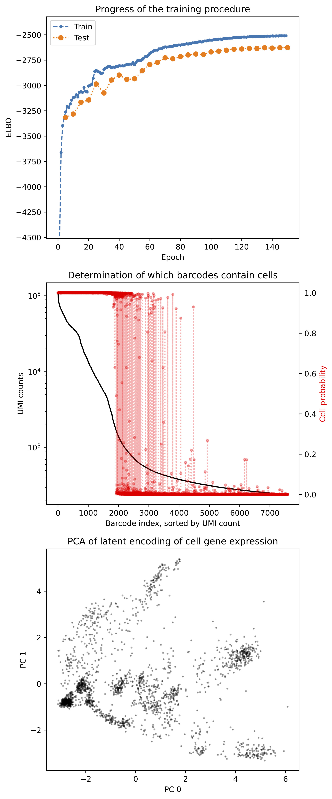

Ambient RNA removal using CellBender
================
Xian Xin
2023-03-02

-   <a href="#introduction" id="toc-introduction">Introduction</a>
-   <a href="#required-inputs" id="toc-required-inputs">Required inputs</a>
-   <a href="#run-cellbender" id="toc-run-cellbender">Run CellBender</a>
-   <a href="#outputs" id="toc-outputs">Outputs</a>

## Introduction

[CellBender](https://github.com/broadinstitute/CellBender) can remove
background ambient RNA and barcode-swapped reads from a raw UMI-based
scRNA-seq count matrix (output from `Cell Ranger count`), producing a
new count matrix and determining which barcodes contain real cells. In
this vignette, we use one sample from SCN2A mouse datasets to
demonstrate how to run *CellBender* in terminal. This vignette is based
on [*CellBender*
tutorial](https://cellbender.readthedocs.io/en/latest/getting_started/remove_background/index.html).

For detailed instruction of *CellBender* installation, please refer to
[Quality Control using CRMetrics vignette](./QC.md).

## Required inputs

The required input data format of *CellBender* can be as either
`_raw_gene_barcode_matrices_h5.h5` (Cell Ranger v2) /
`_raw_feature_barcode_matrix.h5` (Cell Ranger v3) file, or as the path
containing the raw `matrix.mtx, barcodes.tsv, and genes.tsv` (Cell
Ranger v2) / `matrix.mtx.gz, barcodes.tsv.gz, and features.tsv.gz` (Cell
Ranger v3) files. Supported for outputs of CellRanger v2 and v3.

## Run CellBender

We can easily run *CellBender* as command line in terminal:

``` bash
conda activate cellbender
cellbender remove-background \
  --input /people/gjl413/data/FORpipeline_example/P14/P14_het_1/outs/raw_feature_bc_matrix.h5 \
  --output /people/gjl413/data/FORpipeline_example/P14/P14_het_1/outs/cellbender.h5 \
  --cuda \
  --expected-cells 2528 \
  --total-droplets-included 7584 \
  --fpr 0.01 \
  --epochs 150 
```

Introduction for setting parameters:

-   `--epochs`: 150 is recommended by *CellBender* developers. Look for
    a reasonably-converged ELBO value in the output PDF learning curve
    (meaning it looks like it has reached some saturating value). Do not
    over-train as it can increase the likelihood of over-fitting.
    *CellBender* can regularize to prevent over-fitting, but training
    for more than 300 epochs is not advisable.

-   `--expected-cells`: Base this on either the number of cells expected
    from the experimental design, or if this is not known, base this
    number on the UMI curve as shown below. Pick a number where all
    droplets to the left on the UMI curve should be real cells.

-   `--total-droplets-included`: Choose a number that goes a few
    thousand barcodes into the “empty droplet plateau” as shown below.
    Include some droplets that are surely empty. The larger this number,
    the longer the algorithm takes to run. This kind of UMI curve can be
    seen in the `web_summary.html` output from `Cell Ranger count`.


-   `--cuda`: Including this parameter means to be run on a GPU.
    Otherwise *CellBender* will be run on CPU (much slower).

-   `--fpr`: 0.01 is generally good, but we can also generate a few
    output count matrices and compare them by choosing a few values:
    0.01 0.05 0.1.

## Outputs

After finishing *CellBender* computation, the outputs will include the
following files:

-   `cellbender.h5`: An HDF5 file containing a detailed output of the
    inference procedure, including the normalized abundance of ambient
    transcripts, contamination fraction of each droplet, a
    low-dimensional embedding of the background-corrected gene
    expression, and the background-corrected counts matrix (in CSC
    sparse format).

-   `cellbender_filtered.h5`: Same as above but only including droplets
    with estimated cell probability exceeding 0.5. We can load filtered
    count matrix from this file for downstream analyses, e.g., *scanpy*,
    *Seurat* and *Pagoda2*.

-   `cellbender_cell_barcodes.csv`: The list of barcodes with estimated
    cell probability exceeding 0.5.

-   `cellbender.pdf`: A PDF summary of the results showing (1) the
    evolution of the loss function during training, (2) a ranked-ordered
    total UMI plot along with posterior cell probabilities, and (3) a
    two-dimensional PCA scatter plot of the latent embedding of the
    expressions in cell-containing droplets. The pdf is shown below.


