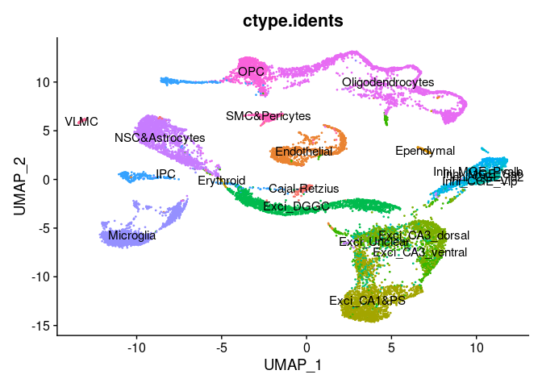
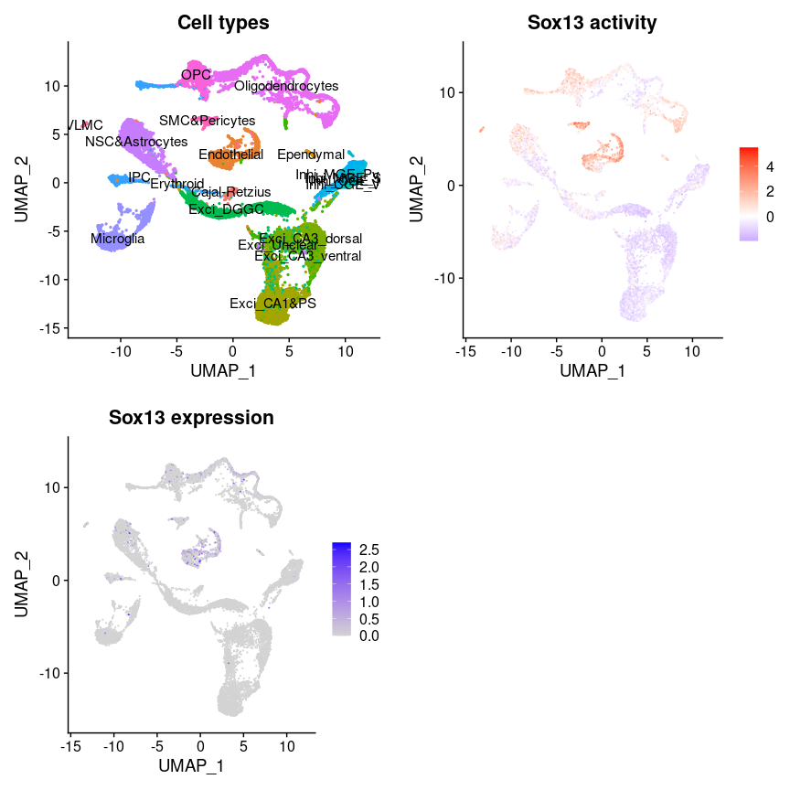
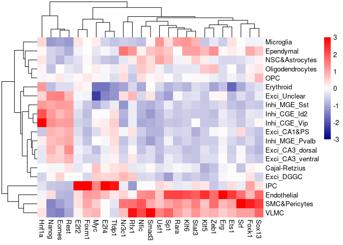
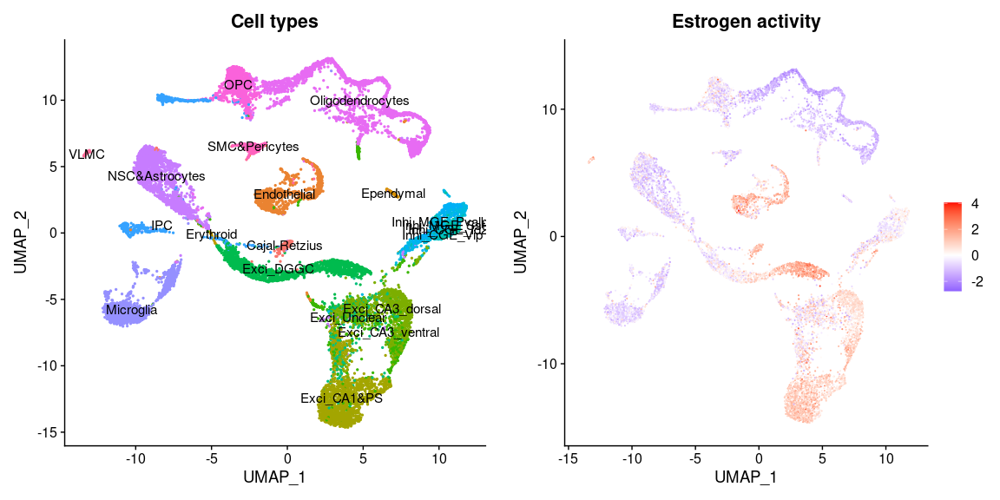
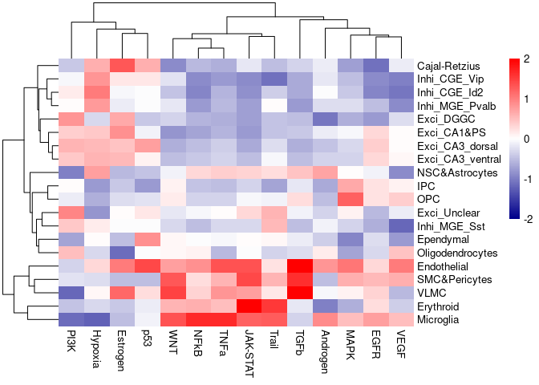

Transcriptional factor activity and pathway activity inference using
decoupleR
================
Xian Xin
2023-03-02

-   <a href="#introduction" id="toc-introduction">Introduction</a>
-   <a href="#package-installation" id="toc-package-installation">Package
    installation</a>
-   <a href="#input-data-preparation" id="toc-input-data-preparation">Input
    data preparation</a>
    -   <a href="#prepare-data-from-conos-object"
        id="toc-prepare-data-from-conos-object">Prepare data from Conos
        object</a>
-   <a href="#prepare-dorothea-network-and-progeny-model"
    id="toc-prepare-dorothea-network-and-progeny-model">Prepare DoRothEA
    network and PROGENy model</a>
    -   <a
        href="#dorothea-network-for-transcriptional-factor-activity-inference"
        id="toc-dorothea-network-for-transcriptional-factor-activity-inference">DoRothEA
        network for transcriptional factor activity inference</a>
    -   <a href="#progeny-model-for-pathway-activity-inference"
        id="toc-progeny-model-for-pathway-activity-inference">PROGENy model for
        pathway activity inference</a>
-   <a href="#activity-inference-with-weighted-mean"
    id="toc-activity-inference-with-weighted-mean">Activity inference with
    Weighted Mean</a>
    -   <a href="#transcriptional-factor-activity-inference"
        id="toc-transcriptional-factor-activity-inference">Transcriptional
        factor activity inference</a>
    -   <a href="#pathway-activity-inference"
        id="toc-pathway-activity-inference">Pathway activity inference</a>
-   <a href="#visualisation" id="toc-visualisation">Visualisation</a>
    -   <a href="#transcriptional-factor-activity-inference-results"
        id="toc-transcriptional-factor-activity-inference-results">Transcriptional
        factor activity inference results</a>
    -   <a href="#pathway-activity-inference-results"
        id="toc-pathway-activity-inference-results">Pathway activity inference
        results</a>

## Introduction

[decoupleR](https://github.com/saezlab/decoupleR) is a package
containing different statistical methods to extract biological
activities from omics data within a unified framework. It allows to
flexibly test any method with any prior knowledge resource and
incorporates methods that take into account the sign and weight. It can
be used with any omic, as long as its features can be linked to a
biological process based on prior knowledge.

In this vignette, we will use Scn2a mouse model data to walk through
*decoupleR* usage for transcriptional factor activity inference using
*DoRothEA* network, and pathway activity inference using *PROGENy*
model. For faster and memory efficient implementation, you can refer to
[Python implementation of decoupleR]() (not yet completed). This
vignette is based on [decoupleR
tutorial](https://www.bioconductor.org/packages/release/bioc/html/decoupleR.html).

## Package installation

To install the stable version of *decoupleR*, use:

``` r
install.packages("BiocManager")
BiocManager::install("decoupleR")
```

To install the latest version, use:

``` r
install.packages("devtools")
devtools::install_github("saezlab/decoupleR")
```

**Please note**: to avoid mutate error when downloading DoRothEA
resource, you need to install the latest version of *OmnipathR* from
GitHub:

``` r
devtools::install_github('saezlab/OmnipathR')
```

``` r
library(Seurat)
library(decoupleR)
library(conos)
library(dplyr)
library(tibble)
library(tidyr)
library(patchwork)
library(ggplot2)
library(pheatmap)
library(magrittr)
```

## Input data preparation

### Prepare data from Conos object

*decoupleR* requires log-normalized expression matrix as inputs, and it
works well with *Seurat* objects. For *Conos* users, you can extract the
joint count matrix from *Conos* object to run the standard *Seurat*
pipeline before running *decoupleR*.

``` r
# Load Conos object and cell type annotation info
con <- qs::qread("/people/gjl413/data/FORpipeline_example/con.qs", nthreads = 32)
cell.anno <- readRDS("/people/gjl413/data/FORpipeline_example/cell.anno.rds")
```

``` r
# Seurat fast workflow
cm <- con$getJointCountMatrix(raw = T) %>% Matrix::t()
seu <- CreateSeuratObject(counts = cm, project = "P14_Scn2a", min.cells = 3, min.features = 200)
seu[["percent.mt"]] <- PercentageFeatureSet(seu, pattern = "^mt-")
seu <- subset(seu, subset = nCount_RNA > 1000 & percent.mt < 5)
seu <- NormalizeData(seu, normalization.method = "LogNormalize", scale.factor = 10000)
seu <- FindVariableFeatures(seu, selection.method = "vst", nfeatures = 2000)
all.genes <- rownames(seu)
seu <- ScaleData(seu, features = all.genes)
seu <- RunPCA(seu, features = VariableFeatures(object = seu), verbose = F)
seu <- FindNeighbors(seu, dims = 1:10, verbose = F)
seu <- FindClusters(seu, resolution = 1, verbose = F)
seu <- RunUMAP(seu, dims = 1:10, umap.method = "uwot", metric = "cosine")
```

``` r
# Add cell type annotation into Seurat metadata
seu <- AddMetaData(
  object = seu,
  metadata = cell.anno[colnames(seu)],
  col.name = "ctype.idents"
)
```

``` r
DimPlot(seu, reduction = "umap", group.by = "ctype.idents", label = T, pt.size = 0.3) + NoLegend()
```

<!-- -->

## Prepare DoRothEA network and PROGENy model

### DoRothEA network for transcriptional factor activity inference

*DoRothEA* is a comprehensive resource containing a curated collection
of TFs and their transcriptional targets. Interactions in *DoRothEA* are
classified in different confidence levels, ranging from A (highest
confidence) to D (lowest confidence). Moreover, each interaction is
weighted by its confidence level and the sign of its mode of regulation
(activation or inhibition). For this example we will use the mouse
version (human is also available) and we will use the confidence levels
ABC. We can use *decoupleR* to retrieve it from *OmniPath*:

``` r
net.dorothea <- get_dorothea(organism = "mouse", levels = c("A", "B", "C"))
head(net.dorothea)
```

    ## # A tibble: 6 × 4
    ##   source confidence target     mor
    ##   <chr>  <chr>      <chr>    <dbl>
    ## 1 Adnp   C          Atf7ip   0.333
    ## 2 Adnp   C          Dyrk1a   0.333
    ## 3 Adnp   C          Tlk1     0.333
    ## 4 Adnp   C          Zmym4    0.333
    ## 5 Ahr    C          Arhgap15 0.333
    ## 6 Ahr    C          Arid5b   0.333

### PROGENy model for pathway activity inference

*PROGENy* is a comprehensive resource containing a curated collection of
pathways and their target genes, with weights for each interaction. For
this example we will use the mouse weights (human is also available) and
we will use the top 100 responsive genes ranked by p-value. We can use
*decoupleR* to retrieve it from *OmniPath*:

``` r
net.progeny <- get_progeny(organism = "mouse", top = 100)
head(net.progeny)
```

    ## # A tibble: 6 × 4
    ##   source   target  weight  p_value
    ##   <chr>    <chr>    <dbl>    <dbl>
    ## 1 Androgen Tmprss2  11.5  2.38e-47
    ## 2 Androgen Nkx3-1   10.6  2.21e-44
    ## 3 Androgen Mboat2   10.5  4.63e-44
    ## 4 Androgen Klk2     10.2  1.94e-40
    ## 5 Androgen Sarg     11.4  2.79e-40
    ## 6 Androgen Slc38a4   7.36 1.25e-39

## Activity inference with Weighted Mean

*decoupleR* contains several methods. To check how many are available,
run:

``` r
show_methods()
```

    ## # A tibble: 12 × 2
    ##    Function      Name                                                           
    ##    <chr>         <chr>                                                          
    ##  1 run_aucell    AUCell                                                         
    ##  2 run_consensus Consensus score between methods                                
    ##  3 run_fgsea     Fast Gene Set Enrichment Analysis (FGSEA)                      
    ##  4 run_gsva      Gene Set Variation Analysis (GSVA)                             
    ##  5 run_mdt       Multivariate Decision Trees (MDT)                              
    ##  6 run_mlm       Multivariate Linear Model (MLM)                                
    ##  7 run_ora       Over Representation Analysis (ORA)                             
    ##  8 run_udt       Univariate Decision Tree (UDT)                                 
    ##  9 run_ulm       Univariate Linear Model (ULM)                                  
    ## 10 run_viper     Virtual Inference of Protein-activity by Enriched Regulon anal…
    ## 11 run_wmean     Weighted Mean (WMEAN)                                          
    ## 12 run_wsum      Weighted Sum (WSUM)

To infer activities we will run the Weighted Mean method (`wmean`). It
infers regulator activities by first multiplying each target feature by
its associated weight which then are summed to an enrichment score
`wmean`. Furthermore, permutations of random target features can be
performed to obtain a null distribution that can be used to compute a
z-score `norm_wmean`, or a corrected estimate `corr_wmean` by
multiplying wmean by the minus log10 of the obtained empirical p-value.
In this example we use `wmean` for both TF activity and pathway activity
inference but we could have used any other.

### Transcriptional factor activity inference

``` r
acts.dorothea <- run_wmean(mat = seu@assays$RNA@data, net = net.dorothea, .source = "source", .target = "target", .mor = "mor", times = 100, minsize = 5)
head(acts.dorothea)
```

### Pathway activity inference

``` r
acts.progeny <- run_wmean(mat = seu@assays$RNA@data, net = net.progeny, .source = "source", .target = "target", .mor = "weight", times = 100, minsize = 5)
```

## Visualisation

### Transcriptional factor activity inference results

From the obtained results, we will select the `norm_wmean` activities
and store them in our object as a new assay called `tfswmean`:

``` r
# Extract norm_wmean and store it in tfswmean in Seurat object
seu[["tfswmean"]] <- acts.dorothea %>%
  filter(statistic == "norm_wmean") %>%
  pivot_wider(id_cols = "source", names_from = "condition", values_from = "score") %>%
  column_to_rownames("source") %>%
  Seurat::CreateAssayObject(.)

# Change assay
DefaultAssay(object = seu) <- "tfswmean"

# Scale the data
seu <- ScaleData(seu)
seu@assays$tfswmean@data <- seu@assays$tfswmean@scale.data
```

This new assay can be used to plot activities.

``` r
p1 <- DimPlot(seu, reduction = "umap", label = T, pt.size = 0.5, group.by = "ctype.idents") + NoLegend() + ggtitle("Cell types")
p2 <- (FeaturePlot(seu, features = c("Sox13")) & scale_colour_gradient2(low = "blue", mid = "white", high = "red")) + ggtitle("Sox13 activity")
DefaultAssay(object = seu) <- "RNA"
p3 <- FeaturePlot(seu, features = c("Sox13")) + ggtitle("Sox13 expression")
DefaultAssay(object = seu) <- "tfswmean"
cowplot::plot_grid(p1, p2, p3, ncol = 2)
```

<!-- --> We can
also see what is the mean activity per group of the top 25 more variable
TFs:

``` r
n_tfs <- 25
# Extract activities from object as a long dataframe
df <- t(as.matrix(seu@assays$tfswmean@data)) %>%
  as.data.frame() %>%
  mutate(cluster = cell.anno[colnames(seu)]) %>%
  pivot_longer(cols = -cluster, names_to = "source", values_to = "score") %>%
  group_by(cluster, source) %>%
  summarise(mean = mean(score))

# Get top tfs with more variable means across clusters
tfs <- df %>%
  group_by(source) %>%
  summarise(std = sd(mean)) %>%
  arrange(-abs(std)) %>%
  head(n_tfs) %>%
  pull(source)

# Subset long data frame to top tfs and transform to wide matrix
top_acts_mat <- df %>%
  filter(source %in% tfs) %>%
  pivot_wider(id_cols = "cluster", names_from = "source", values_from = "mean") %>%
  column_to_rownames("cluster") %>%
  as.matrix()

# Choose color palette
palette_length = 100
my_color = colorRampPalette(c("Darkblue", "white","red"))(palette_length)

my_breaks <- c(seq(-3, 0, length.out = ceiling(palette_length / 2) + 1),
               seq(0.05, 3, length.out = floor(palette_length / 2)))

# Plot
pheatmap(top_acts_mat, border_color = NA, color = my_color, breaks = my_breaks)
```

<!-- -->

### Pathway activity inference results

From the obtained results, we will select the `norm_wmean` activities
and store them in our object as a new assay called `pathwayswmean`:

``` r
# Extract norm_wmean and store it in pathwayswmean in data
seu[["pathwayswmean"]] <- acts.progeny %>%
  filter(statistic == "norm_wmean") %>%
  pivot_wider(id_cols = "source", names_from = "condition",
              values_from = "score") %>%
  column_to_rownames("source") %>%
  Seurat::CreateAssayObject(.)

# Change assay
DefaultAssay(object = seu) <- "pathwayswmean"

# Scale the data
seu <- ScaleData(seu)
seu@assays$pathwayswmean@data <- seu@assays$pathwayswmean@scale.data
```

This new assay can be used to plot activities.

``` r
p1 <- DimPlot(seu, reduction = "umap", label = T, pt.size = 0.5, group.by = "ctype.idents") + NoLegend() + ggtitle("Cell types")
p2 <- (FeaturePlot(seu, features = c("Estrogen")) & scale_colour_gradient2(low = "blue", mid = "white", high = "red")) + ggtitle("Estrogen activity")
cowplot::plot_grid(p1, p2, ncol = 2)
```

<!-- -->

We can also see what is the mean activity per group across pathways:

``` r
# Extract activities from object as a long dataframe
df <- t(as.matrix(seu@assays$pathwayswmean@data)) %>%
  as.data.frame() %>%
  mutate(cluster = cell.anno[colnames(seu)]) %>%
  pivot_longer(cols = -cluster, names_to = "source", values_to = "score") %>%
  group_by(cluster, source) %>%
  summarise(mean = mean(score))

# Transform to wide matrix
top_acts_mat <- df %>%
  pivot_wider(id_cols = "cluster", names_from = "source",
              values_from = "mean") %>%
  column_to_rownames("cluster") %>%
  as.matrix()

# Choose color palette
palette_length = 100
my_color = colorRampPalette(c("Darkblue", "white","red"))(palette_length)

my_breaks <- c(seq(-2, 0, length.out=ceiling(palette_length / 2) + 1),
               seq(0.05, 2, length.out=floor(palette_length / 2)))

# Plot
pheatmap(top_acts_mat, border_color = NA, color = my_color, breaks = my_breaks)
```

<!-- -->

``` r
sessionInfo()
```

    ## R version 4.2.2 (2022-10-31)
    ## Platform: x86_64-pc-linux-gnu (64-bit)
    ## Running under: Red Hat Enterprise Linux 8.7 (Ootpa)
    ## 
    ## Matrix products: default
    ## BLAS:   /usr/local/R-4.2.2/lib64/R/lib/libRblas.so
    ## LAPACK: /usr/local/R-4.2.2/lib64/R/lib/libRlapack.so
    ## 
    ## locale:
    ##  [1] LC_CTYPE=en_US.UTF-8       LC_NUMERIC=C              
    ##  [3] LC_TIME=en_US.UTF-8        LC_COLLATE=en_US.UTF-8    
    ##  [5] LC_MONETARY=en_US.UTF-8    LC_MESSAGES=en_US.UTF-8   
    ##  [7] LC_PAPER=en_US.UTF-8       LC_NAME=C                 
    ##  [9] LC_ADDRESS=C               LC_TELEPHONE=C            
    ## [11] LC_MEASUREMENT=en_US.UTF-8 LC_IDENTIFICATION=C       
    ## 
    ## attached base packages:
    ## [1] stats     graphics  grDevices utils     datasets  methods   base     
    ## 
    ## other attached packages:
    ##  [1] magrittr_2.0.3     pheatmap_1.0.12    ggplot2_3.4.0      patchwork_1.1.2   
    ##  [5] tidyr_1.3.0        tibble_3.1.8       dplyr_1.1.0        conos_1.5.0       
    ##  [9] igraph_1.3.5       Matrix_1.5-3       decoupleR_2.4.0    SeuratObject_4.1.3
    ## [13] Seurat_4.3.0      
    ## 
    ## loaded via a namespace (and not attached):
    ##   [1] utf8_1.2.3             spatstat.explore_3.0-6 reticulate_1.28       
    ##   [4] R.utils_2.12.2         tidyselect_1.2.0       htmlwidgets_1.6.1     
    ##   [7] grid_4.2.2             Rtsne_0.16             munsell_0.5.0         
    ##  [10] codetools_0.2-18       ica_1.0-3              future_1.31.0         
    ##  [13] miniUI_0.1.1.1         withr_2.5.0            spatstat.random_3.1-3 
    ##  [16] colorspace_2.1-0       progressr_0.13.0       logger_0.2.2          
    ##  [19] highr_0.10             knitr_1.42             rstudioapi_0.14       
    ##  [22] stats4_4.2.2           ROCR_1.0-11            tensor_1.5            
    ##  [25] listenv_0.9.0          labeling_0.4.2         urltools_1.7.3        
    ##  [28] polyclip_1.10-4        bit64_4.0.5            farver_2.1.1          
    ##  [31] parallelly_1.34.0      vctrs_0.5.2            generics_0.1.3        
    ##  [34] xfun_0.37              R6_2.5.1               doParallel_1.0.17     
    ##  [37] clue_0.3-64            spatstat.utils_3.0-1   vroom_1.6.1           
    ##  [40] promises_1.2.0.1       scales_1.2.1           gtable_0.3.1          
    ##  [43] globals_0.16.2         goftest_1.2-3          drat_0.2.3            
    ##  [46] rlang_1.0.6            GlobalOptions_0.1.2    splines_4.2.2         
    ##  [49] lazyeval_0.2.2         spatstat.geom_3.0-6    brew_1.0-8            
    ##  [52] checkmate_2.1.0        yaml_2.3.7             reshape2_1.4.4        
    ##  [55] abind_1.4-5            backports_1.4.1        httpuv_1.6.8          
    ##  [58] tools_4.2.2            sccore_1.0.3           ellipsis_0.3.2        
    ##  [61] RColorBrewer_1.1-3     BiocGenerics_0.44.0    ggridges_0.5.4        
    ##  [64] Rcpp_1.0.10            plyr_1.8.8             progress_1.2.2        
    ##  [67] purrr_1.0.1            prettyunits_1.1.1      dendsort_0.3.4        
    ##  [70] deldir_1.0-6           pbapply_1.7-0          GetoptLong_1.0.5      
    ##  [73] cowplot_1.1.1          S4Vectors_0.36.1       zoo_1.8-11            
    ##  [76] ggrepel_0.9.2          cluster_2.1.4          data.table_1.14.6     
    ##  [79] scattermore_0.8        circlize_0.4.15        lmtest_0.9-40         
    ##  [82] triebeard_0.3.0        RANN_2.6.1             fitdistrplus_1.1-8    
    ##  [85] matrixStats_0.63.0     stringfish_0.15.7      hms_1.1.2             
    ##  [88] qs_0.25.4              mime_0.12              evaluate_0.20         
    ##  [91] xtable_1.8-4           readxl_1.4.1           RMTstat_0.3.1         
    ##  [94] N2R_1.0.1              IRanges_2.32.0         gridExtra_2.3         
    ##  [97] shape_1.4.6            compiler_4.2.2         KernSmooth_2.23-20    
    ## [100] crayon_1.5.2           R.oo_1.25.0            htmltools_0.5.4       
    ## [103] mgcv_1.8-41            later_1.3.0            tzdb_0.3.0            
    ## [106] RcppParallel_5.1.6     DBI_1.1.3              RApiSerialize_0.1.2   
    ## [109] pagoda2_1.0.10         ComplexHeatmap_2.14.0  MASS_7.3-58.1         
    ## [112] rappdirs_0.3.3         readr_2.1.3            cli_3.6.0             
    ## [115] R.methodsS3_1.8.2      parallel_4.2.2         pkgconfig_2.0.3       
    ## [118] OmnipathR_3.7.2        sp_1.6-0               plotly_4.10.1         
    ## [121] spatstat.sparse_3.0-0  xml2_1.3.3             foreach_1.5.2         
    ## [124] leidenAlg_1.0.5        rvest_1.0.3            stringr_1.5.0         
    ## [127] digest_0.6.31          sctransform_0.3.5      RcppAnnoy_0.0.20      
    ## [130] spatstat.data_3.0-0    cellranger_1.1.0       rmarkdown_2.20        
    ## [133] leiden_0.4.3           Rook_1.2               uwot_0.1.14           
    ## [136] curl_5.0.0             shiny_1.7.4            rjson_0.2.21          
    ## [139] lifecycle_1.0.3        nlme_3.1-160           jsonlite_1.8.4        
    ## [142] viridisLite_0.4.1      fansi_1.0.4            pillar_1.8.1          
    ## [145] lattice_0.20-45        fastmap_1.1.0          httr_1.4.4            
    ## [148] survival_3.4-0         glue_1.6.2             png_0.1-8             
    ## [151] iterators_1.0.14       bit_4.0.5              stringi_1.7.12        
    ## [154] irlba_2.3.5.1          future.apply_1.10.0
