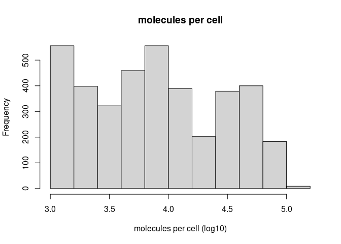
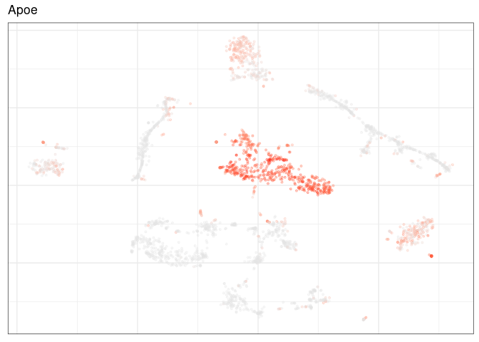

Pagoda2 analysis of single sample
================
Xian Xin
2023-03-02

-   <a href="#introduction" id="toc-introduction">Introduction</a>
-   <a href="#fast-processing" id="toc-fast-processing">Fast processing</a>
-   <a href="#detailed-processing" id="toc-detailed-processing">Detailed
    processing</a>
    -   <a href="#load-count-matrix-and-quality-control"
        id="toc-load-count-matrix-and-quality-control">Load count matrix and
        quality control</a>
    -   <a href="#analyzing-using-pagoda2"
        id="toc-analyzing-using-pagoda2">Analyzing using Pagoda2</a>
    -   <a href="#web-application-generation"
        id="toc-web-application-generation">Web application generation</a>

## Introduction

[Pagoda2](https://github.com/kharchenkolab/pagoda2) is optimized to
rapidly process modern scRNAseq datasets, which are both large and
sparse. The package provides methods for quality control, filtering,
clustering, visualization, differential expression, cross-cutting
aspects/states, geneset/pathway overdispersion analysis and generating
interactive frontend application. In this vignette, we will demonstrate
*Pagoda2* usage with Scn2a mouse data. This vignette is based on
[*Pagoda2*
walkthrough](https://htmlpreview.github.io/?https://raw.githubusercontent.com/kharchenkolab/pagoda2/main/doc/pagoda2.walkthrough.html).

For detailed instruction of *Pagoda2* installation, please refer to
[Single-cell RNA-seq datasets processing using Pagoda2 and
Conos](./align_cluster.md).

``` r
library(Matrix)
library(igraph)
library(pagoda2)
library(dplyr)
library(ggplot2)
```

## Fast processing

This is a fast walkthrough showing how to quickly process datasets.

``` r
## load the count matrix
cms <- qs::qread("/people/gjl413/data/FORpipeline_example/cms.filtered.qs")
cm <- cms[["P14_wt_1"]]

## all basic pagoda2 processing with basicP2proc()
p2.processed <- basicP2proc(cm, n.cores = 1, min.cells.per.gene = 10, n.odgenes = 2e3, get.largevis = F, make.geneknn = F)
```

## Detailed processing

### Load count matrix and quality control

Load the count matrices of Scn2a mouse 10X dataset. In order to directly
read in data from the *Cell Ranger* outputs, you can also use the
function `read10xMatrix()`.

``` r
cms <- qs::qread("/people/gjl413/data/FORpipeline_example/cms.filtered.qs")
str(cms)
```

    ## List of 6
    ##  $ P14_het_1:Formal class 'dgCMatrix' [package "Matrix"] with 6 slots
    ##   .. ..@ i       : int [1:8454356] 0 2 8 9 10 13 16 20 21 23 ...
    ##   .. ..@ p       : int [1:1752] 0 9277 18437 27370 36336 44981 53682 62446 71424 80037 ...
    ##   .. ..@ Dim     : int [1:2] 32285 1751
    ##   .. ..@ Dimnames:List of 2
    ##   .. .. ..$ : chr [1:32285] "Xkr4" "Gm1992" "Gm19938" "Gm37381" ...
    ##   .. .. ..$ : chr [1:1751] "P14_het_1!!TTGCCTGCAGCGTGAA-1" "P14_het_1!!TGCTCCAAGCCACTCG-1" "P14_het_1!!CATCCCAGTCCCTAAA-1" "P14_het_1!!TGCATGAAGGTTGTTC-1" ...
    ##   .. ..@ x       : num [1:8454356] 2 6 11 7 2 18 10 10 1 1 ...
    ##   .. ..@ factors : list()
    ##  $ P14_het_2:Formal class 'dgCMatrix' [package "Matrix"] with 6 slots
    ##   .. ..@ i       : int [1:9612313] 0 2 8 9 10 11 13 16 17 19 ...
    ##   .. ..@ p       : int [1:2476] 0 8823 18211 27589 36130 44653 54104 62652 71015 79333 ...
    ##   .. ..@ Dim     : int [1:2] 32285 2475
    ##   .. ..@ Dimnames:List of 2
    ##   .. .. ..$ : chr [1:32285] "Xkr4" "Gm1992" "Gm19938" "Gm37381" ...
    ##   .. .. ..$ : chr [1:2475] "P14_het_2!!CACCGTTTCCATTTCA-1" "P14_het_2!!GCCATTCTCCTCTCGA-1" "P14_het_2!!CATTTCATCAGACCGC-1" "P14_het_2!!GTGCGTGCAACTGCCG-1" ...
    ##   .. ..@ x       : num [1:9612313] 2 7 5 2 9 1 10 16 1 17 ...
    ##   .. ..@ factors : list()
    ##  $ P14_het_3:Formal class 'dgCMatrix' [package "Matrix"] with 6 slots
    ##   .. ..@ i       : int [1:13922424] 0 2 8 9 10 13 16 17 20 21 ...
    ##   .. ..@ p       : int [1:4704] 0 9947 19192 28616 37894 47174 56928 66196 75300 84261 ...
    ##   .. ..@ Dim     : int [1:2] 32285 4703
    ##   .. ..@ Dimnames:List of 2
    ##   .. .. ..$ : chr [1:32285] "Xkr4" "Gm1992" "Gm19938" "Gm37381" ...
    ##   .. .. ..$ : chr [1:4703] "P14_het_3!!TCAATTCCAATCTAGC-1" "P14_het_3!!AGCATCAAGCAAACAT-1" "P14_het_3!!TAGCACACAATACCCA-1" "P14_het_3!!CTAACTTTCGTTGCCT-1" ...
    ##   .. ..@ x       : num [1:13922424] 11 8 8 2 7 12 17 3 25 1 ...
    ##   .. ..@ factors : list()
    ##  $ P14_wt_1 :Formal class 'dgCMatrix' [package "Matrix"] with 6 slots
    ##   .. ..@ i       : int [1:13828869] 2 8 9 10 11 13 16 17 19 20 ...
    ##   .. ..@ p       : int [1:3854] 0 8691 18024 26675 36082 43907 53324 62618 70996 80370 ...
    ##   .. ..@ Dim     : int [1:2] 32285 3853
    ##   .. ..@ Dimnames:List of 2
    ##   .. .. ..$ : chr [1:32285] "Xkr4" "Gm1992" "Gm19938" "Gm37381" ...
    ##   .. .. ..$ : chr [1:3853] "P14_wt_1!!CATTCCGCAGGTTTAC-1" "P14_wt_1!!TCTACCGTCTACTGCC-1" "P14_wt_1!!AATGACCTCCTCCACA-1" "P14_wt_1!!CATCGGGCAGCATTGT-1" ...
    ##   .. ..@ x       : num [1:13828869] 2 8 1 10 1 11 6 2 11 21 ...
    ##   .. ..@ factors : list()
    ##  $ P14_wt_2 :Formal class 'dgCMatrix' [package "Matrix"] with 6 slots
    ##   .. ..@ i       : int [1:9447295] 0 2 8 9 10 13 16 17 19 20 ...
    ##   .. ..@ p       : int [1:2387] 0 8546 18604 27328 35518 43735 52041 61228 71171 80360 ...
    ##   .. ..@ Dim     : int [1:2] 32285 2386
    ##   .. ..@ Dimnames:List of 2
    ##   .. .. ..$ : chr [1:32285] "Xkr4" "Gm1992" "Gm19938" "Gm37381" ...
    ##   .. .. ..$ : chr [1:2386] "P14_wt_2!!TCGAAGTCATTCAGCA-1" "P14_wt_2!!CAGCAGCGTATGATCC-1" "P14_wt_2!!GGGACAAAGGATGGCT-1" "P14_wt_2!!TCACTATTCAAGAGGC-1" ...
    ##   .. ..@ x       : num [1:9447295] 1 9 8 3 6 15 2 1 19 7 ...
    ##   .. ..@ factors : list()
    ##  $ P14_wt_3 :Formal class 'dgCMatrix' [package "Matrix"] with 6 slots
    ##   .. ..@ i       : int [1:14340400] 0 2 8 9 10 11 13 16 17 20 ...
    ##   .. ..@ p       : int [1:4335] 0 11317 20356 29369 38252 47944 57003 66400 75337 83906 ...
    ##   .. ..@ Dim     : int [1:2] 32285 4334
    ##   .. ..@ Dimnames:List of 2
    ##   .. .. ..$ : chr [1:32285] "Xkr4" "Gm1992" "Gm19938" "Gm37381" ...
    ##   .. .. ..$ : chr [1:4334] "P14_wt_3!!CTCAGTCAGTCCCGAC-1" "P14_wt_3!!TCACTATCACGCTGCA-1" "P14_wt_3!!AGGGTTTTCATCACCC-1" "P14_wt_3!!GAGACTTTCCGTAGGC-1" ...
    ##   .. ..@ x       : num [1:14340400] 19 7 16 5 21 3 24 27 1 27 ...
    ##   .. ..@ factors : list()

``` r
cm <- cms[["P14_wt_1"]]
```

``` r
str(cm)
```

    ## Formal class 'dgCMatrix' [package "Matrix"] with 6 slots
    ##   ..@ i       : int [1:13828869] 2 8 9 10 11 13 16 17 19 20 ...
    ##   ..@ p       : int [1:3854] 0 8691 18024 26675 36082 43907 53324 62618 70996 80370 ...
    ##   ..@ Dim     : int [1:2] 32285 3853
    ##   ..@ Dimnames:List of 2
    ##   .. ..$ : chr [1:32285] "Xkr4" "Gm1992" "Gm19938" "Gm37381" ...
    ##   .. ..$ : chr [1:3853] "P14_wt_1!!CATTCCGCAGGTTTAC-1" "P14_wt_1!!TCTACCGTCTACTGCC-1" "P14_wt_1!!AATGACCTCCTCCACA-1" "P14_wt_1!!CATCGGGCAGCATTGT-1" ...
    ##   ..@ x       : num [1:13828869] 2 8 1 10 1 11 6 2 11 21 ...
    ##   ..@ factors : list()

Look at the summary counts across cells and across genes.

``` r
hist(log10(colSums(cm) + 1), main = "molecules per cell", xlab = "molecules per cell (log10)")
```

<!-- -->

``` r
hist(log10(rowSums(cm) + 1), main = "molecules per gene", xlab="molecules per gene (log10)")
```

<!-- -->

This dataset has already been filtered for low quality cells, so we
don’t see any cells with fewer that 1000 UMIs. We can still use the QC
function `gene.vs.molecule.cell.filter()` to filter any cells not
fitting the expected detected gene vs. molecule count relationship or
with fewer than 1500 UMIs.

``` r
counts <- gene.vs.molecule.cell.filter(cm, min.cell.size = 1500)
```

<!-- -->

``` r
str(counts)
```

    ## Formal class 'dgCMatrix' [package "Matrix"] with 6 slots
    ##   ..@ i       : int [1:10306391] 0 2 8 10 13 14 16 19 20 21 ...
    ##   ..@ p       : int [1:2913] 0 7416 15172 22689 30461 38063 45911 53442 61143 68960 ...
    ##   ..@ Dim     : int [1:2] 32285 2912
    ##   ..@ Dimnames:List of 2
    ##   .. ..$ : chr [1:32285] "Xkr4" "Gm1992" "Gm19938" "Gm37381" ...
    ##   .. ..$ : chr [1:2912] "P14_wt_1!!GTGCTTCAGATCGACG-1" "P14_wt_1!!ATCGATGTCTGAGAAA-1" "P14_wt_1!!AGAACAACAAAGGGCT-1" "P14_wt_1!!TGGGATTAGCCAGACA-1" ...
    ##   ..@ x       : num [1:10306391] 2 5 6 3 2 3 6 1 3 3 ...
    ##   ..@ factors : list()

``` r
hist(log10(rowSums(counts) + 1), main = "Molecules per gene", xlab = "molecules (log10)")
abline(v = 1, lty = 2, col = 2)
```

<!-- -->

We can also check the number of molecules per gene, and remove
low-expressed genes to save computational time.

``` r
counts <- counts[rowSums(counts) >= 10, ]
```

``` r
str(counts)
```

    ## Formal class 'dgCMatrix' [package "Matrix"] with 6 slots
    ##   ..@ i       : int [1:10291753] 0 1 3 5 7 8 10 12 13 14 ...
    ##   ..@ p       : int [1:2913] 0 7393 15136 22640 30399 37990 45817 53330 61015 68803 ...
    ##   ..@ Dim     : int [1:2] 17065 2912
    ##   ..@ Dimnames:List of 2
    ##   .. ..$ : chr [1:17065] "Xkr4" "Gm19938" "Sox17" "Mrpl15" ...
    ##   .. ..$ : chr [1:2912] "P14_wt_1!!GTGCTTCAGATCGACG-1" "P14_wt_1!!ATCGATGTCTGAGAAA-1" "P14_wt_1!!AGAACAACAAAGGGCT-1" "P14_wt_1!!TGGGATTAGCCAGACA-1" ...
    ##   ..@ x       : num [1:10291753] 2 5 6 3 2 3 6 1 3 3 ...
    ##   ..@ factors : list()

### Analyzing using Pagoda2

Now we have a clean count matrix that are ready to start analysis. First
we will create `Pagoda2` object that will contain all of the results. It
will also provide handles for running all operations on the data. Use of
`log.scale` is recommended, as it makes some statistics smoother. You
can also specify the number of processing cores `n.cores` that will
speed up some of the analysis steps below.

``` r
p2 <- Pagoda2$new(counts, log.scale = T, n.cores = 32)
```

Next we will adjust the variance to normalize the extent to which genes
with different expression magnitudes will contribute to the downstream
anlaysis.

``` r
p2$adjustVariance(plot = T, gam.k = 10)
```

<!-- -->

We will reduce the dataset dimensions by running PCA, and then move into
k-nearest neighbor graph space for clustering and visualization
calculations. First, we perform the PCA reduction. Depending on the
complexity of the dataset you are analyzing, you may want to adjust the
parameter `nPcs`.

``` r
p2$calculatePcaReduction(nPcs = 50, n.odgenes = 3e3)
```

The next few step will make kNN graph which help find clusters and
generate a embedding to visualize the sub-populations.

``` r
p2$makeKnnGraph(k = 40, type = "PCA", center = T, distance = "cosine")
```

    ## creating space of type angular done
    ## adding data ... done
    ## building index ... done
    ## querying ... done

On the basis of this KNN graph, we will call clusters.

``` r
p2$getKnnClusters(method = infomap.community, type = "PCA")
```

Next we generate a 2D embedding of the data with “largeVis” for
visualization.

``` r
p2$getEmbedding(type = "PCA", embeddingType = "largeVis", M = 30, perplexity = 30, gamma = 1/30)
```

Visualize the data in “largeVis” embedding.

``` r
p2$plotEmbedding(type = "PCA", show.legend = F, mark.groups = T, min.cluster.size = 50, shuffle.colors = F, font.size = 3, alpha = 0.3, title = "largeVis")
```

<!-- -->

You can also construct and plot a “tSNE” or “UMAP” embedding which might
be slower than “largeVis”.

``` r
p2$getEmbedding(type = "PCA", embeddingType = "tSNE", perplexity = 50)
p2$plotEmbedding(type = "PCA", embeddingType = "tSNE", show.legend = F, mark.groups = T, min.cluster.size = 1, shuffle.colors = F, font.size = 3, alpha = 0.3, title = "tSNE")
```

<!-- -->

``` r
p2$getEmbedding(type = "PCA", embeddingType = "UMAP", perplexity = 50)
p2$plotEmbedding(type = "PCA", embeddingType = "UMAP", show.legend = F, mark.groups = T, min.cluster.size = 1, shuffle.colors = F, font.size = 3, alpha = 0.3, title = "UMAP")
```

<!-- -->

We can use the same `plotEmbedding()` function to show all kinds of
other values. For instance, look at the cell depth or an expression
pattern of a gene.

``` r
p2$plotEmbedding(type = "PCA", embeddingType = "tSNE", colors = p2$depth, shuffle.colors = F, font.size = 3, alpha = 0.3, title = "UMI depth")
```

<!-- -->

``` r
p2$plotEmbedding(type = "PCA", embeddingType = "tSNE", colors = p2$counts[, "Apoe"], shuffle.colors = F, font.size = 3, alpha = 0.3, title = "Apoe")
```

<!-- -->

*Pagoda2* allows us to generate multiple alternative clusterings. Here
we will construct multilevel and walktrap clusterings (along with the
infomap clustering generated above):

``` r
p2$getKnnClusters(method = multilevel.community, type = "PCA", name = "multilevel")
p2$getKnnClusters(method = walktrap.community, type = "PCA", name = "walktrap")
str(p2$clusters$PCA)
```

    ## List of 3
    ##  $ community : Factor w/ 36 levels "1","2","3","4",..: 1 2 3 2 2 4 1 1 1 5 ...
    ##   ..- attr(*, "names")= chr [1:2912] "P14_wt_1!!GTGCTTCAGATCGACG-1" "P14_wt_1!!ATCGATGTCTGAGAAA-1" "P14_wt_1!!AGAACAACAAAGGGCT-1" "P14_wt_1!!TGGGATTAGCCAGACA-1" ...
    ##  $ multilevel: Factor w/ 16 levels "1","2","3","4",..: 1 2 2 2 2 3 1 1 1 4 ...
    ##   ..- attr(*, "names")= chr [1:2912] "P14_wt_1!!GTGCTTCAGATCGACG-1" "P14_wt_1!!ATCGATGTCTGAGAAA-1" "P14_wt_1!!AGAACAACAAAGGGCT-1" "P14_wt_1!!TGGGATTAGCCAGACA-1" ...
    ##  $ walktrap  : Factor w/ 17 levels "1","2","3","4",..: 14 4 4 4 4 16 14 14 14 3 ...
    ##   ..- attr(*, "names")= chr [1:2912] "P14_wt_1!!GTGCTTCAGATCGACG-1" "P14_wt_1!!ATCGATGTCTGAGAAA-1" "P14_wt_1!!AGAACAACAAAGGGCT-1" "P14_wt_1!!TGGGATTAGCCAGACA-1" ...

``` r
cowplot::plot_grid(
  p2$plotEmbedding(type = "PCA", embeddingType = "tSNE", clusterType = "community", show.legend = F, mark.groups = T, min.cluster.size = 1, shuffle.colors = F, font.size = 3, alpha = 0.3, title = "infomap clusters (tSNE)"),
  p2$plotEmbedding(type = "PCA", embeddingType = "tSNE", clusterType = "multilevel", show.legend = F, mark.groups = T, min.cluster.size = 1, shuffle.colors = F, font.size = 3, alpha = 0.3, title = "multlevel clusters (tSNE)"),
  p2$plotEmbedding(type = "PCA", embeddingType = "tSNE", clusterType = "walktrap", show.legend = F, mark.groups = T, min.cluster.size = 1, shuffle.colors = F, font.size = 3, alpha = 0.3, title = "walktrap clusters (tSNE)"),
  nrow = 1
)
```

<!-- -->

We can then perform differential expression between these clusters.

``` r
p2$getDifferentialGenes(type = "PCA", clusterType = "community")
```

After this, we can visualise the top markers of a specific cluster. In
this case, we look at cluster \#5.

``` r
de <- p2$diffgenes$PCA$community$`5`
p2$plotGeneHeatmap(genes = rownames(de)[1:15], groups = p2$clusters$PCA$community)
```

<!-- -->

### Web application generation

Next we will generate a web app that will allow us to browse the dataset
interactively. Note that all these steps can be performed with the
`basicP2web()` function, as described above in the first section.

``` r
## calculate pathway overdispersion for mouse
ext.res <- extendedP2proc(p2, organism = 'mm')

## create p2 web app object
p2app <- webP2proc(ext.res$p2, title = 'Pagoda2 app', go.env = ext.res$go.env)

## open app in the web browser via R session
show.app(app = p2app, name = 'pagoda2 app')
```

``` r
sessionInfo()
```

    ## R version 4.2.2 (2022-10-31)
    ## Platform: x86_64-pc-linux-gnu (64-bit)
    ## Running under: Red Hat Enterprise Linux 8.7 (Ootpa)
    ## 
    ## Matrix products: default
    ## BLAS:   /usr/local/R-4.2.2/lib64/R/lib/libRblas.so
    ## LAPACK: /usr/local/R-4.2.2/lib64/R/lib/libRlapack.so
    ## 
    ## locale:
    ##  [1] LC_CTYPE=en_US.UTF-8       LC_NUMERIC=C              
    ##  [3] LC_TIME=en_US.UTF-8        LC_COLLATE=en_US.UTF-8    
    ##  [5] LC_MONETARY=en_US.UTF-8    LC_MESSAGES=en_US.UTF-8   
    ##  [7] LC_PAPER=en_US.UTF-8       LC_NAME=C                 
    ##  [9] LC_ADDRESS=C               LC_TELEPHONE=C            
    ## [11] LC_MEASUREMENT=en_US.UTF-8 LC_IDENTIFICATION=C       
    ## 
    ## attached base packages:
    ## [1] stats     graphics  grDevices utils     datasets  methods   base     
    ## 
    ## other attached packages:
    ## [1] ggplot2_3.4.0  dplyr_1.1.0    pagoda2_1.0.10 igraph_1.3.5   Matrix_1.5-3  
    ## 
    ## loaded via a namespace (and not attached):
    ##  [1] ggrepel_0.9.2       Rcpp_1.0.10         lattice_0.20-45    
    ##  [4] digest_0.6.31       utf8_1.2.3          R6_2.5.1           
    ##  [7] evaluate_0.20       highr_0.10          pillar_1.8.1       
    ## [10] rlang_1.0.6         rstudioapi_0.14     irlba_2.3.5.1      
    ## [13] R.utils_2.12.2      R.oo_1.25.0         drat_0.2.3         
    ## [16] sccore_1.0.3        rmarkdown_2.20      qs_0.25.4          
    ## [19] urltools_1.7.3      labeling_0.4.2      splines_4.2.2      
    ## [22] Rtsne_0.16          RMTstat_0.3.1       triebeard_0.3.0    
    ## [25] munsell_0.5.0       uwot_0.1.14         compiler_4.2.2     
    ## [28] xfun_0.37           pkgconfig_2.0.3     mgcv_1.8-41        
    ## [31] htmltools_0.5.4     tidyselect_1.2.0    tibble_3.1.8       
    ## [34] codetools_0.2-18    fansi_1.0.4         withr_2.5.0        
    ## [37] MASS_7.3-58.1       R.methodsS3_1.8.2   grid_4.2.2         
    ## [40] nlme_3.1-160        gtable_0.3.1        lifecycle_1.0.3    
    ## [43] magrittr_2.0.3      N2R_1.0.1           scales_1.2.1       
    ## [46] RcppParallel_5.1.6  dendsort_0.3.4      KernSmooth_2.23-20 
    ## [49] cli_3.6.0           farver_2.1.1        brew_1.0-8         
    ## [52] generics_0.1.3      vctrs_0.5.2         cowplot_1.1.1      
    ## [55] stringfish_0.15.7   RcppAnnoy_0.0.20    RApiSerialize_0.1.2
    ## [58] rjson_0.2.21        tools_4.2.2         glue_1.6.2         
    ## [61] Rook_1.2            parallel_4.2.2      fastmap_1.1.0      
    ## [64] yaml_2.3.7          colorspace_2.1-0    knitr_1.42
