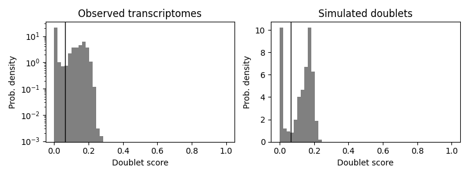
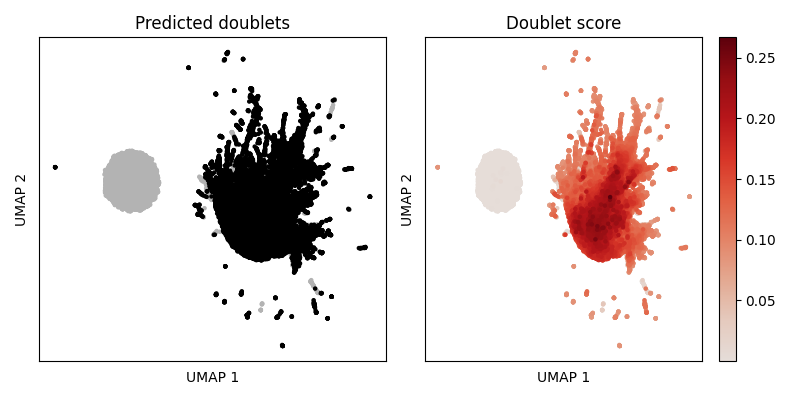

Doublet detection using scrublet
================
Xian Xin
2023-03-02

-   <a href="#introduction" id="toc-introduction">Introduction</a>
-   <a href="#initialise-scrublet-object"
    id="toc-initialise-scrublet-object">Initialise scrublet object</a>
-   <a href="#default-pipeline" id="toc-default-pipeline">Default
    pipeline</a>
-   <a href="#plotting" id="toc-plotting">Plotting</a>
    -   <a href="#doublet-score-histogram"
        id="toc-doublet-score-histogram">Doublet score histogram</a>
    -   <a href="#embedding-plot" id="toc-embedding-plot">Embedding plot</a>
-   <a href="#export-scrublet-results-to-r"
    id="toc-export-scrublet-results-to-r">Export scrublet results to R</a>

## Introduction

[Scrublet](https://github.com/swolock/scrublet) can identify doublets in
scRNA-seq data. It requires count matrix (cells as rows and genes as
columns) as input to calculate doublet scores and call doublets in the
sample. As *scrublet* detects doublets formed by the random
co-encapsulation of two cells, it is recommended to **run on each sample
separately** but not on merged count matrix where cell type proportions
are not representative of any single sample.

After finishing *scrublet* calculation, we recommend to check and adjust
(if necessary) the doublet score threshold to confirm that two peaks of
a bimodal simulated double score histogram can be separated. And
doublets should also be mostly co-localised in a embedding plot.

In this vignette, we use the *CellBender* filtered count matrix from one
SCN2A mouse sample to demonstrate how to run *scrublet* in reticulate
Python environment. This vignette is based on [*scrublet*
tutorial](https://github.com/swolock/scrublet/blob/master/examples/scrublet_basics.ipynb).

For detailed instruction of *scrublet* installation, please refer to
[Quality Control using CRMetrics vignette](./QC.md).

## Initialise scrublet object

To run Python in R Markdown, we need to use *reticulate* to load the
conda environment which contains *scrublet* module.

``` r
library(magrittr)
library(reticulate)
use_miniconda(condaenv = "/home/gjl413/.conda/envs/r-crmetrics/bin/python")
```

To load the count matrix, we simply use a *Seurat* function to read the
hdf5 file.

``` r
cm <- Seurat::Read10X_h5(filename = "/people/gjl413/data/FORpipeline_example/P14/P14_het_1/outs/cellbender_filtered.h5", 
                 use.names = TRUE)
```

**In the rest part of this vignette, the codes are all in Python**. For
running Python in R Markdown, please refer to [*reticulate*
document](https://rstudio.github.io/reticulate/).

``` python
import scrublet as scr
import scipy.io
import matplotlib.pyplot as plt
import numpy as np
import os
```

We can easily use objects from R environment in Python with `r.VAR_NAME`
(and use Python objects in R with `py$VAR_NAME`).

``` python
scrub = scr.Scrublet(r.cm)
```

## Default pipeline

We can run the default *scrublet* pipeline with one function, which
includes:

-   Doublet simulation

-   Normalization, gene filtering, rescaling and PCA

-   Doublet score calculation

-   Doublet score threshold detection and doublet calling

`scr.scrub_doublets()` simulates doublets from the observed data and
uses a k-nearest-neighbor classifier to calculate a continuous
`doublet_scores` (between 0 and 1) for each barcode. The score is
automatically thresholded to generate `predicted_doublets`, a boolean
array that is `True` for predicted doublets and `False` otherwise.

``` python
doublet_scores, predicted_doublets = scrub.scrub_doublets()
```

    ## Preprocessing...
    ## Simulating doublets...
    ## Embedding transcriptomes using PCA...
    ## Calculating doublet scores...
    ## Automatically set threshold at doublet score = 0.07
    ## Detected doublet rate = 52.2%
    ## Estimated detectable doublet fraction = 74.6%
    ## Overall doublet rate:
    ##  Expected   = 10.0%
    ##  Estimated  = 70.0%
    ## Elapsed time: 35.3 seconds
    ## 
    ## /home/gjl413/.conda/envs/r-crmetrics/lib/python3.8/site-packages/scrublet/helper_functions.py:321: RuntimeWarning: divide by zero encountered in true_divide
    ##   w.setdiag(float(target_total) / tots_use)
    ## /home/gjl413/.conda/envs/r-crmetrics/lib/python3.8/site-packages/scrublet/helper_functions.py:252: RuntimeWarning: invalid value encountered in sqrt
    ##   CV_input = np.sqrt(b);

## Plotting

### Doublet score histogram

The simulated doublet histogram is mostly bimodal. The left mode
corresponds to “embedded” doublets, which are generated by droplets
containing two cells with similar gene expression. The right mode
corresponds to “neotypic” doublets, which are generated by droplets
containing cells with distinct gene expression (e.g., different cell
types) and are expected to introduce more artifacts in downstream
analyses. Scrublet can only detect “neotypic” doublets.

To call doublets vs. singlets, we must set a threshold doublet score,
ideally at the minimum between the two modes of the histogram.
`scrub_doublets()` can automatically identify this point and has done a
good job in most cases. However, if automatic threshold detection does
not work well, you can adjust the threshold with the `call_doublets()`
function. For example:

`scrub.call_doublets(threshold=0.25)`

``` python
scrub.plot_histogram()
```



### Embedding plot

``` python
scrub.set_embedding('UMAP', scr.get_umap(scrub.manifold_obs_, 10, min_dist=0.3))
```

Predicted doublets should be co-localised in distinct states.

``` python
scrub.plot_embedding('UMAP', order_points=True)
```



## Export scrublet results to R

``` r
# execute in R
doublet.scores <- py$doublet_scores %>% 
  setNames(colnames(cm))
predicted.doublets <- py$predicted_doublets %>% 
  setNames(colnames(cm))
```

``` r
head(doublet.scores)
```

    ## TTGCCTGCAGCGTGAA-1 TGCTCCAAGCCACTCG-1 CATCCCAGTCCCTAAA-1 TGCATGAAGGTTGTTC-1 
    ##         0.16408669         0.00020496         0.17647059         0.00020496 
    ## TGGAACTAGGTCCGAA-1 TGCGACGCATAACTCG-1 
    ##         0.08118619         0.10252101

``` r
head(predicted.doublets)
```

    ## TTGCCTGCAGCGTGAA-1 TGCTCCAAGCCACTCG-1 CATCCCAGTCCCTAAA-1 TGCATGAAGGTTGTTC-1 
    ##               TRUE              FALSE               TRUE              FALSE 
    ## TGGAACTAGGTCCGAA-1 TGCGACGCATAACTCG-1 
    ##               TRUE               TRUE

``` r
sessionInfo()
```

    ## R version 4.2.2 (2022-10-31)
    ## Platform: x86_64-pc-linux-gnu (64-bit)
    ## Running under: Red Hat Enterprise Linux 8.7 (Ootpa)
    ## 
    ## Matrix products: default
    ## BLAS:   /usr/local/R-4.2.2/lib64/R/lib/libRblas.so
    ## LAPACK: /usr/local/R-4.2.2/lib64/R/lib/libRlapack.so
    ## 
    ## locale:
    ##  [1] LC_CTYPE=en_US.UTF-8       LC_NUMERIC=C              
    ##  [3] LC_TIME=en_US.UTF-8        LC_COLLATE=en_US.UTF-8    
    ##  [5] LC_MONETARY=en_US.UTF-8    LC_MESSAGES=en_US.UTF-8   
    ##  [7] LC_PAPER=en_US.UTF-8       LC_NAME=C                 
    ##  [9] LC_ADDRESS=C               LC_TELEPHONE=C            
    ## [11] LC_MEASUREMENT=en_US.UTF-8 LC_IDENTIFICATION=C       
    ## 
    ## attached base packages:
    ## [1] stats     graphics  grDevices utils     datasets  methods   base     
    ## 
    ## other attached packages:
    ## [1] reticulate_1.28 magrittr_2.0.3 
    ## 
    ## loaded via a namespace (and not attached):
    ##   [1] Seurat_4.3.0           Rtsne_0.16             colorspace_2.1-0      
    ##   [4] deldir_1.0-6           ellipsis_0.3.2         ggridges_0.5.4        
    ##   [7] rprojroot_2.0.3        rstudioapi_0.14        spatstat.data_3.0-0   
    ##  [10] leiden_0.4.3           listenv_0.9.0          bit64_4.0.5           
    ##  [13] ggrepel_0.9.2          fansi_1.0.4            codetools_0.2-18      
    ##  [16] splines_4.2.2          knitr_1.42             polyclip_1.10-4       
    ##  [19] jsonlite_1.8.4         ica_1.0-3              cluster_2.1.4         
    ##  [22] png_0.1-8              uwot_0.1.14            shiny_1.7.4           
    ##  [25] sctransform_0.3.5      spatstat.sparse_3.0-0  compiler_4.2.2        
    ##  [28] httr_1.4.4             SeuratObject_4.1.3     Matrix_1.5-3          
    ##  [31] fastmap_1.1.0          lazyeval_0.2.2         cli_3.6.0             
    ##  [34] later_1.3.0            htmltools_0.5.4        tools_4.2.2           
    ##  [37] igraph_1.3.5           gtable_0.3.1           glue_1.6.2            
    ##  [40] RANN_2.6.1             reshape2_1.4.4         dplyr_1.1.0           
    ##  [43] rappdirs_0.3.3         Rcpp_1.0.10            scattermore_0.8       
    ##  [46] vctrs_0.5.2            nlme_3.1-160           spatstat.explore_3.0-6
    ##  [49] progressr_0.13.0       lmtest_0.9-40          spatstat.random_3.1-3 
    ##  [52] xfun_0.37              stringr_1.5.0          globals_0.16.2        
    ##  [55] mime_0.12              miniUI_0.1.1.1         lifecycle_1.0.3       
    ##  [58] irlba_2.3.5.1          goftest_1.2-3          future_1.31.0         
    ##  [61] MASS_7.3-58.1          zoo_1.8-11             scales_1.2.1          
    ##  [64] promises_1.2.0.1       spatstat.utils_3.0-1   parallel_4.2.2        
    ##  [67] RColorBrewer_1.1-3     yaml_2.3.7             pbapply_1.7-0         
    ##  [70] gridExtra_2.3          ggplot2_3.4.0          stringi_1.7.12        
    ##  [73] highr_0.10             rlang_1.0.6            pkgconfig_2.0.3       
    ##  [76] matrixStats_0.63.0     evaluate_0.20          lattice_0.20-45       
    ##  [79] ROCR_1.0-11            purrr_1.0.1            tensor_1.5            
    ##  [82] patchwork_1.1.2        htmlwidgets_1.6.1      bit_4.0.5             
    ##  [85] cowplot_1.1.1          tidyselect_1.2.0       here_1.0.1            
    ##  [88] parallelly_1.34.0      RcppAnnoy_0.0.20       plyr_1.8.8            
    ##  [91] R6_2.5.1               generics_0.1.3         DBI_1.1.3             
    ##  [94] pillar_1.8.1           withr_2.5.0            fitdistrplus_1.1-8    
    ##  [97] survival_3.4-0         abind_1.4-5            sp_1.6-0              
    ## [100] tibble_3.1.8           future.apply_1.10.0    hdf5r_1.3.8           
    ## [103] KernSmooth_2.23-20     utf8_1.2.3             spatstat.geom_3.0-6   
    ## [106] plotly_4.10.1          rmarkdown_2.20         grid_4.2.2            
    ## [109] data.table_1.14.6      digest_0.6.31          xtable_1.8-4          
    ## [112] tidyr_1.3.0            httpuv_1.6.8           munsell_0.5.0         
    ## [115] viridisLite_0.4.1
