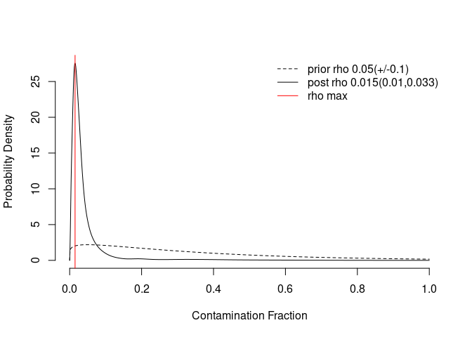
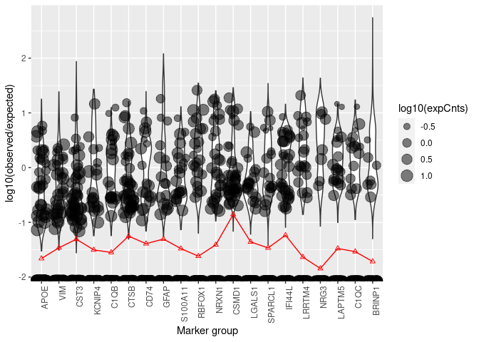

Ambient RNA removal using SoupX
================
Xian Xin
2023-03-02

-   <a href="#introduction" id="toc-introduction">Introduction</a>
-   <a href="#default-pipeline" id="toc-default-pipeline">Default
    pipeline</a>
    -   <a href="#load-10x-data-and-estimate-soup-profile"
        id="toc-load-10x-data-and-estimate-soup-profile">Load 10X data and
        estimate “soup” profile</a>
    -   <a href="#estimate-the-level-of-background-contamination-rho"
        id="toc-estimate-the-level-of-background-contamination-rho">Estimate the
        level of background contamination (rho).</a>
    -   <a href="#clean-the-data" id="toc-clean-the-data">Clean the data</a>

## Introduction

[SoupX](https://github.com/constantAmateur/SoupX) can estimate and
remove cell-free mRNA contamination in droplet based single cell RNA-seq
data. It uses *Cell Ranger* raw `count matrix` and `analysis` results as
inputs (for automated method, highly recommended), and the final output
of *SoupX* contains a corrected expression matrix for downstream
analyses. In this vignette, we will demonstrate how to perform *SoupX*
automated analysis for one sample from SCN2A mouse datasets. This
vignette is based on [*SoupX*
tutorial](https://rawcdn.githack.com/constantAmateur/SoupX/204b602418df12e9fdb4b68775a8b486c6504fe4/inst/doc/pbmcTutorial.html),
and you can also get detailed information (e.g., manual estimation) from
this tutorial.

For detailed instruction of *SoupX* installation, please refer to
[Quality Control using CRMetrics vignette](./QC.md).

## Default pipeline

In droplet-based single-cell RNA-seq experiments, there is always a
certain amount of background mRNAs present in the dilution that gets
distributed into the droplets with cells and sequenced along with them.
The net effect of this is to produce a background contamination that
represents expression not from the cell contained within a droplet, but
the solution that contained the cells.

“Soup” is the collection of cell free mRNAs floating in the input
solution, which is created from cells in the input solution being lysed.
Because of this, the “soup” looks different for each input solution and
strongly resembles the expression pattern obtained by summing all the
individual cells.

The pipeline consists of three parts:

-   Calculate the profile of the “soup”.

-   Estimate the cell-specific contamination fraction.

-   Infer a corrected expression matrix.

``` r
library(SoupX)
```

### Load 10X data and estimate “soup” profile

This function can load 10X count matrix and clustering information
(generated by *Cell Ranger*), and automatically estimate “soup” profile.

``` r
sc <- load10X(dataDir = "/data/ExtData/CRMetrics_testdata/SRR15054421/outs/")
```

    ## Loading raw count data

    ## Loading cell-only count data

    ## Loading extra analysis data where available

### Estimate the level of background contamination (rho).

``` r
sc <- autoEstCont(sc)
```

    ## 1464 genes passed tf-idf cut-off and 252 soup quantile filter.  Taking the top 100.

    ## Using 483 independent estimates of rho.

    ## Estimated global rho of 0.01

<!-- -->

The solid curve shows something like the frequency of different
estimates of rho, with a red line indicating its peak, which gives the
estimate of rho.

We can use `plotMarkerDistribution()` to visualise the distribution of
expression (relative to what would be expected were each cell pure
background) across all cells in the dataset. When no geneset is
provided, the function will try and guess which genes might be useful.

``` r
plotMarkerDistribution(sc)
```

    ## No gene lists provided, attempting to find and plot cluster marker genes.

    ## Found 1464 marker genes

<!-- -->

``` r
head(sc$metaData)
```

    ##                    nUMIs clusters clustersFine      tSNE1     tSNE2   rho
    ## AAACCCAAGCCACCGT-1  7876        4            1  28.967533 -2.522924 0.015
    ## AAACCCACAGTGACCC-1  6684        5            1  -6.239277 31.187639 0.015
    ## AAACCCATCACAGTGT-1 16602        8            5 -51.738865 -4.023249 0.015
    ## AAACCCATCATCCTAT-1  6103        1            1   1.722548 10.134806 0.015
    ## AAACGAACACAACATC-1  9369        9            1  14.799608 20.602527 0.015
    ## AAACGAAGTCGACTTA-1 12893        6            7 -39.579606  9.217650 0.015

### Clean the data

``` r
out <- adjustCounts(sc)
```

    ## Expanding counts from 10 clusters to 5404 cells.

``` r
str(out)
```

    ## Formal class 'dgCMatrix' [package "Matrix"] with 6 slots
    ##   ..@ i       : int [1:13952632] 27 32 53 61 72 74 78 91 93 130 ...
    ##   ..@ p       : int [1:5405] 0 3010 5669 11435 13941 17177 19396 21141 23743 26667 ...
    ##   ..@ Dim     : int [1:2] 33538 5404
    ##   ..@ Dimnames:List of 2
    ##   .. ..$ : chr [1:33538] "MIR1302-2HG" "FAM138A" "OR4F5" "AL627309.1" ...
    ##   .. ..$ : chr [1:5404] "AAACCCAAGCCACCGT-1" "AAACCCACAGTGACCC-1" "AAACCCATCACAGTGT-1" "AAACCCATCATCCTAT-1" ...
    ##   ..@ x       : num [1:13952632] 11.204 0.986 0.956 2.973 0.987 ...
    ##   ..@ factors : list()

The `adjustCounts()` will produce a non-integer sparse matrix where the
original counts have been corrected for background expression. You
should not change the method parameter unless you have a strong reason
to do so. When you need integer counts for downstream analyses, setting
`roundToInt=TRUE`, stochastically rounds up with probability equal to
the fraction part of the number.

``` r
out.int <- adjustCounts(sc, roundToInt = T)
```

    ## Expanding counts from 10 clusters to 5404 cells.

The output expression matrix can be directly used in downstream analysis
tools, e.g., *scanpy*, *Seurat*, and *Pagoda2*. If you would like to
save these final counts out in the same format as *Cell Ranger*, you can
use the `DropletUtils::write10xCounts()` function.

``` r
DropletUtils::write10xCounts("./strainedCounts", out)
```

Before moving on to next-step analysis, we can check what has been the
most strongly decreased by looking at the fraction of cells that were
non-zero now set to zero after correction.

``` r
cnt.soggy <- apply(sc$toc > 0, 1, sum)
cnt.strained <- apply(out > 0, 1, sum)
most.zeroed <- tail(sort((cnt.soggy - cnt.strained) / cnt.soggy), n = 10)
most.zeroed 
```

    ##       NRG1       C1QB       MMP9      DPP10     CHI3L1        CCK AC117465.1 
    ##  0.1500000  0.1526980  0.1666667  0.1722222  0.1743421  0.2152778  0.2359551 
    ##       SYT1       XIST       ANO1 
    ##  0.2520000  0.2666667  0.4821429

Additionally, we can check genes for which there is a quantitative
difference.

``` r
tail(sort(apply(sc$toc > out, 1, sum) / apply(sc$toc > 0, 1, sum)), n = 20)
```

    ##     MT-CO1     MT-CO2    MT-ATP8    MT-ATP6     MT-CO3     MT-ND3    MT-ND4L 
    ##          1          1          1          1          1          1          1 
    ##     MT-ND4     MT-ND5     MT-ND6     MT-CYB AC136352.3 AC145212.1 AC011043.1 
    ##          1          1          1          1          1          1          1 
    ## AC011043.2 AL592183.1 AC007325.4 AC007325.2 AL354822.1 AC240274.1 
    ##          1          1          1          1          1          1

``` r
sessionInfo()
```

    ## R version 4.2.2 (2022-10-31)
    ## Platform: x86_64-pc-linux-gnu (64-bit)
    ## Running under: Red Hat Enterprise Linux 8.7 (Ootpa)
    ## 
    ## Matrix products: default
    ## BLAS:   /usr/local/R-4.2.2/lib64/R/lib/libRblas.so
    ## LAPACK: /usr/local/R-4.2.2/lib64/R/lib/libRlapack.so
    ## 
    ## locale:
    ##  [1] LC_CTYPE=en_US.UTF-8       LC_NUMERIC=C              
    ##  [3] LC_TIME=en_US.UTF-8        LC_COLLATE=en_US.UTF-8    
    ##  [5] LC_MONETARY=en_US.UTF-8    LC_MESSAGES=en_US.UTF-8   
    ##  [7] LC_PAPER=en_US.UTF-8       LC_NAME=C                 
    ##  [9] LC_ADDRESS=C               LC_TELEPHONE=C            
    ## [11] LC_MEASUREMENT=en_US.UTF-8 LC_IDENTIFICATION=C       
    ## 
    ## attached base packages:
    ## [1] stats     graphics  grDevices utils     datasets  methods   base     
    ## 
    ## other attached packages:
    ## [1] SoupX_1.6.2
    ## 
    ## loaded via a namespace (and not attached):
    ##   [1] Seurat_4.3.0           Rtsne_0.16             colorspace_2.1-0      
    ##   [4] deldir_1.0-6           ellipsis_0.3.2         ggridges_0.5.4        
    ##   [7] rstudioapi_0.14        spatstat.data_3.0-0    farver_2.1.1          
    ##  [10] leiden_0.4.3           listenv_0.9.0          ggrepel_0.9.2         
    ##  [13] fansi_1.0.4            R.methodsS3_1.8.2      codetools_0.2-18      
    ##  [16] splines_4.2.2          knitr_1.42             polyclip_1.10-4       
    ##  [19] jsonlite_1.8.4         ica_1.0-3              cluster_2.1.4         
    ##  [22] R.oo_1.25.0            png_0.1-8              uwot_0.1.14           
    ##  [25] shiny_1.7.4            sctransform_0.3.5      spatstat.sparse_3.0-0 
    ##  [28] compiler_4.2.2         httr_1.4.4             SeuratObject_4.1.3    
    ##  [31] Matrix_1.5-3           fastmap_1.1.0          lazyeval_0.2.2        
    ##  [34] cli_3.6.0              later_1.3.0            htmltools_0.5.4       
    ##  [37] tools_4.2.2            igraph_1.3.5           gtable_0.3.1          
    ##  [40] glue_1.6.2             RANN_2.6.1             reshape2_1.4.4        
    ##  [43] dplyr_1.1.0            Rcpp_1.0.10            scattermore_0.8       
    ##  [46] vctrs_0.5.2            spatstat.explore_3.0-6 nlme_3.1-160          
    ##  [49] progressr_0.13.0       lmtest_0.9-40          spatstat.random_3.1-3 
    ##  [52] xfun_0.37              stringr_1.5.0          globals_0.16.2        
    ##  [55] mime_0.12              miniUI_0.1.1.1         lifecycle_1.0.3       
    ##  [58] irlba_2.3.5.1          goftest_1.2-3          future_1.31.0         
    ##  [61] MASS_7.3-58.1          zoo_1.8-11             scales_1.2.1          
    ##  [64] promises_1.2.0.1       spatstat.utils_3.0-1   parallel_4.2.2        
    ##  [67] RColorBrewer_1.1-3     yaml_2.3.7             reticulate_1.28       
    ##  [70] pbapply_1.7-0          gridExtra_2.3          ggplot2_3.4.0         
    ##  [73] stringi_1.7.12         highr_0.10             rlang_1.0.6           
    ##  [76] pkgconfig_2.0.3        matrixStats_0.63.0     evaluate_0.20         
    ##  [79] lattice_0.20-45        ROCR_1.0-11            purrr_1.0.1           
    ##  [82] tensor_1.5             labeling_0.4.2         patchwork_1.1.2       
    ##  [85] htmlwidgets_1.6.1      cowplot_1.1.1          tidyselect_1.2.0      
    ##  [88] parallelly_1.34.0      RcppAnnoy_0.0.20       plyr_1.8.8            
    ##  [91] magrittr_2.0.3         R6_2.5.1               generics_0.1.3        
    ##  [94] DBI_1.1.3              withr_2.5.0            pillar_1.8.1          
    ##  [97] fitdistrplus_1.1-8     survival_3.4-0         abind_1.4-5           
    ## [100] sp_1.6-0               tibble_3.1.8           future.apply_1.10.0   
    ## [103] KernSmooth_2.23-20     utf8_1.2.3             spatstat.geom_3.0-6   
    ## [106] plotly_4.10.1          rmarkdown_2.20         grid_4.2.2            
    ## [109] data.table_1.14.6      digest_0.6.31          xtable_1.8-4          
    ## [112] tidyr_1.3.0            httpuv_1.6.8           R.utils_2.12.2        
    ## [115] munsell_0.5.0          viridisLite_0.4.1
